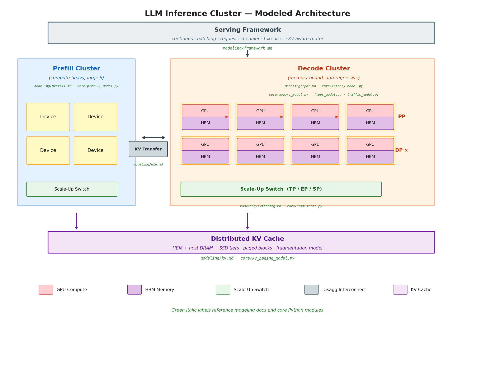
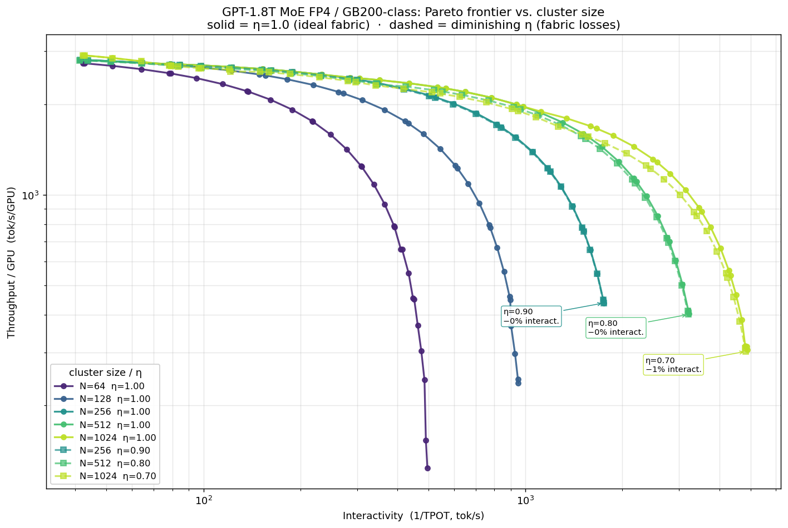
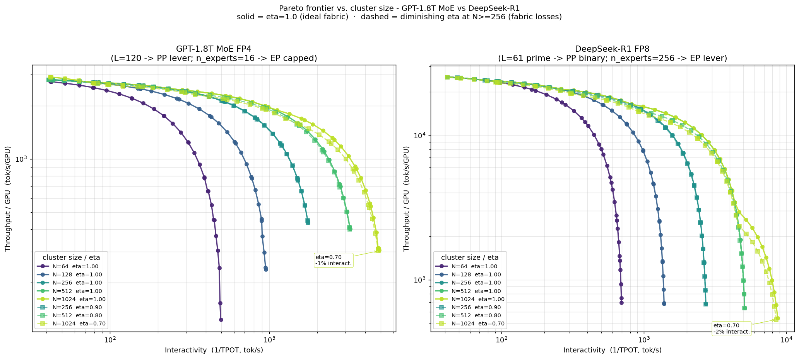
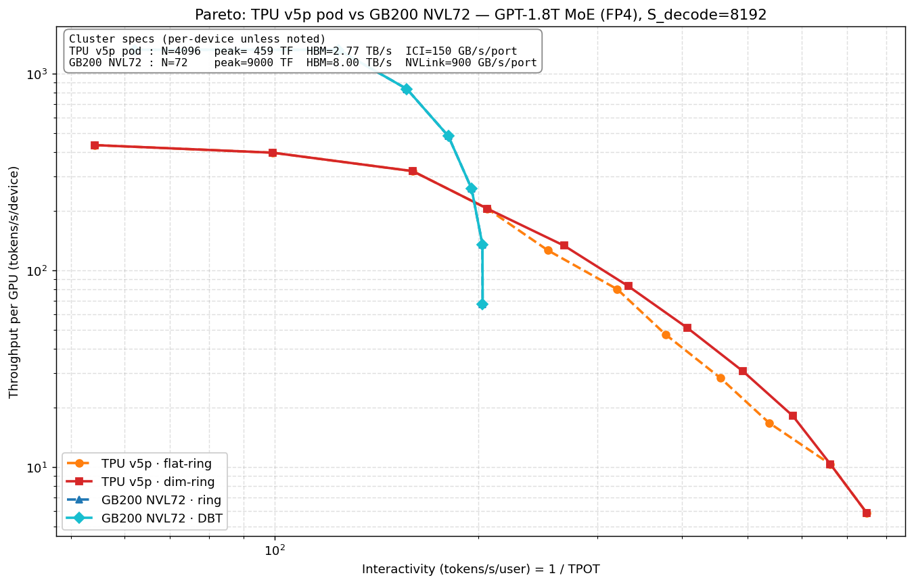
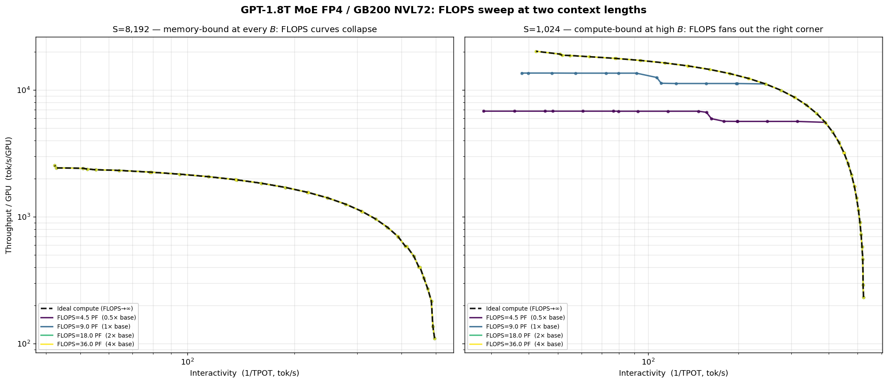
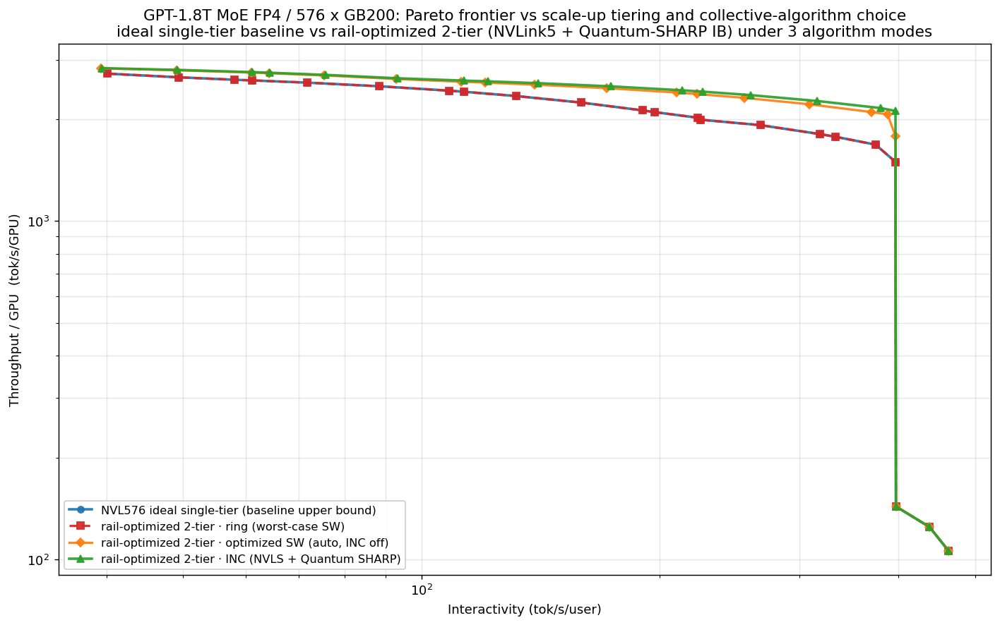
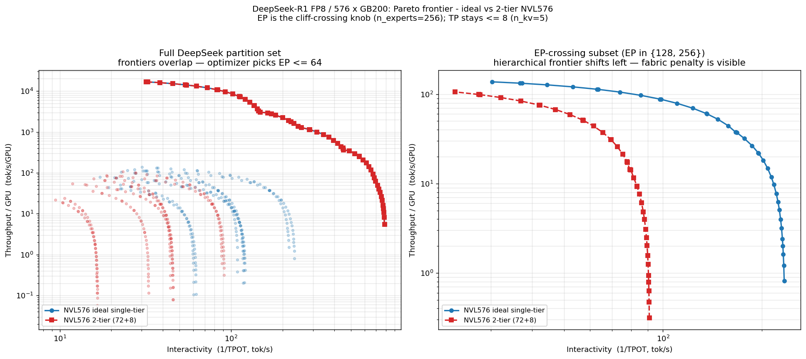
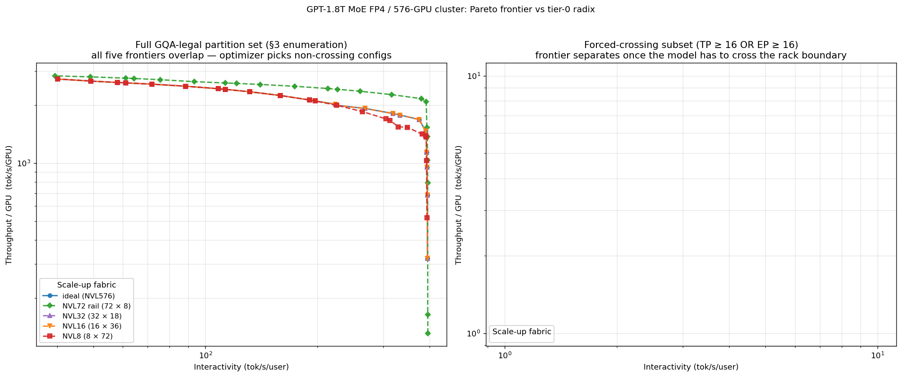

# llm_perf

`llm_perf` is a lightweight, first-principles analytical framework for large-language-model inference performance modeling. It predicts latency, throughput, and memory footprint of LLM inference on a given cluster *before* you build or rent it — from a JSON description of the model, the hardware, the parallelism layout, and a handful of tuning knobs.

The core is a five-stage pipeline (memory → FLOPs → traffic → comm → latency) extended with prefill, end-to-end metric assembly, KV paging, chunked prefill, and disaggregated prefill/decode. Everything is composable pure functions over typed dataclasses — no global state, no training-specific baggage.

---

## Modeled Architecture



The diagram above shows the components of an LLM inference cluster that `llm_perf` models analytically. The system is organized as a disaggregated prefill/decode pipeline with a shared distributed KV cache underneath.

**Serving Framework** sits at the top of the stack — continuous batching, request scheduling, tokenization, and KV-aware routing. The framework contributes per-request and per-step CPU overhead (scheduler dispatch, CUDA graph replay, token sampling, detokenization) modeled via `OverheadSpec` and folded into E2E latency. See [`modeling/framework.md`](documentation/modeling/framework.md).

**Prefill Cluster** is the compute-heavy phase that processes the full input prompt in one (or multiple chunked) forward passes. Each device runs the same transformer layers but at sequence-length `S` rather than single-token decode. Prefill FLOPs scale quadratically with `S` in the attention block and linearly in the FFN/projection layers. See [`modeling/prefill.md`](documentation/modeling/prefill.md) and [`core/prefill_model.py`](llm_perf/core/prefill_model.py).

**Decode Cluster** is the memory-bandwidth-bound autoregressive phase. Devices are connected via a scale-up switch that carries TP, EP, and SP collectives; pipeline-parallel (PP) stages communicate via point-to-point sends. Data parallelism (DP) replicates the full pipeline to increase throughput without affecting per-request latency. The roofline model inside each device balances compute time against HBM read time, and the overlap-aware latency model hides communication behind whichever is the bottleneck. See [`modeling/decode.md`](documentation/modeling/decode.md) and [`core/decode_model.py`](llm_perf/core/decode_model.py).

**KV Transfer** interconnect bridges the two clusters in a disaggregated deployment. When prefill and decode run on separate device groups, the KV cache produced during prefill must be shipped to the decode cluster before autoregressive generation can begin. The transfer cost (startup latency α + bulk BW) is modeled in [`modeling/e2e.md`](documentation/modeling/e2e.md) and can dominate TTFT for short prompts or low-bandwidth fabrics.

**Distributed KV Cache** spans HBM, host DRAM, and SSD tiers. `llm_perf` models PagedAttention-style block accounting — block size, per-sequence block count, internal fragmentation, and effective HBM capacity after subtracting weights and activations — to determine the maximum concurrent-sequence batch a given partition can serve. See [`modeling/kv.md`](documentation/modeling/kv.md) and [`core/kv_paging_model.py`](llm_perf/core/kv_paging_model.py).

The **scale-up switch** within each cluster carries collective traffic for tensor parallelism (TP), expert parallelism (EP), and sequence parallelism (SP). The collective cost model accounts for effective per-port bandwidth under aggregate capacity constraints, latency (α), and the algorithm choice (ring vs. tree, plus in-network reduction where the fabric supports it). See [`modeling/collectives.md`](documentation/modeling/collectives.md) and [`core/primitives/collective_cost.py`](llm_perf/core/primitives/collective_cost.py).

**Hierarchical scale-up.** Each parallelism domain is described by an ordered list of switching tiers (innermost first), each with its own radix `P_i`, per-port bandwidth `BW_i`, and latency `α_i`. A collective over `G` ranks crosses the minimum number of tiers needed to reach all ranks; multi-tier all-reduce decomposes as inner reduce-scatter → outer sub-AR → inner all-gather, with payload telescoping shrinking the cross-tier traffic. A single-tier list reproduces the legacy flat `(α_role, BW_role)` model exactly; multi-tier configurations (e.g. NVL72 intra-rack NVSwitch + inter-rack aggregation) are supported via a `"tiers": [...]` JSON form. See [`modeling/collectives.md`](documentation/modeling/collectives.md) §3.3 "Hierarchical RS → sub-AR → AG composition" and the `pareto_vs_scale_up_tier` case study for a worked example.

---

## Key Modeling Equations

One line per component in the architecture diagram above. Full derivations live in `documentation/modeling/*.md`; this table is a cross-reference, not a second source of truth.

| Component | Key equation(s) | Doc |
|---|---|---|
| Serving Framework | TTFT picks up $t_\mathrm{sched} + t_\mathrm{tok} + t_\mathrm{detok}$; TPOT picks up $t_\mathrm{graph} + t_\mathrm{sample}$ — per-request terms land in TTFT, per-step terms land in TPOT | [`framework.md`](documentation/modeling/framework.md) |
| Prefill Cluster | $t_\mathrm{prefill} = \max(t_\mathrm{compute}, t_\mathrm{mem}) + t_\mathrm{comm} + t_\mathrm{warmup}$; prefill FLOPs scale as $S$ (FFN/proj) $+ S^2$ (attention); KV traffic scales as $S$ | [`prefill.md`](documentation/modeling/prefill.md) |
| Decode Cluster | $t_\mathrm{local} = \max(t_\mathrm{compute}, t_\mathrm{mem})$; $t_\mathrm{comm} = t_\mathrm{TP} + t_\mathrm{EP} + t_\mathrm{SP} + t_\mathrm{PP}$ (per-role collectives summed per pipeline stage, each priced by the scale-up switch row below); $t_\mathrm{token} = t_\mathrm{local} + \max(0, t_\mathrm{comm} - \rho \cdot t_\mathrm{local})$; $\mathrm{TPOT} = t_\mathrm{token} / B$; memory→compute crossover at $B^* = T_\theta \cdot R / (F_\mathrm{token} \cdot \mathrm{BW_\mathrm{HBM}} - T_\mathrm{kv} \cdot R)$ | [`decode.md`](documentation/modeling/decode.md) |
| Scale-up Switch | $t_\mathrm{coll}(M, G) = \alpha_\mathrm{span}(G) + \beta \cdot M / \mathrm{BW_\mathrm{span}}(G)$; algorithm-dependent $\beta$: ring-AR $= 2(G-1)/G$, A2A $= (G-1)/G$, P2P $= 1$; $\alpha_\mathrm{span}$ and $\mathrm{BW_\mathrm{span}}$ come from flattening the fabric tier-chain, innermost first | [`collectives.md`](documentation/modeling/collectives.md) |
| KV Transfer | $t_\mathrm{KV} = \alpha_\mathrm{disagg} + M_\mathrm{KV} / \mathrm{BW_\mathrm{disagg}}$ with $M_\mathrm{KV} = (L/\mathrm{PP}) \cdot 2 S \cdot H_\mathrm{kv} \cdot b$ (0 for co-located) | [`e2e.md`](documentation/modeling/e2e.md) |
| Distributed KV Cache | $N_\mathrm{seq,max} = \lfloor M_\mathrm{avail} / (N_\mathrm{blocks} \cdot M_\mathrm{block} \cdot \varphi_\mathrm{avg}) \rfloor$ where $M_\mathrm{avail} = \mathrm{HBM} - M_\theta - M_\mathrm{act} - M_\mathrm{sys}$ and $\varphi_\mathrm{avg} = 1 + B_\mathrm{blk} / (2 S)$ | [`kv.md`](documentation/modeling/kv.md) |
| E2E Assembly | $\mathrm{E2E}(N_\mathrm{out}) = \mathrm{TTFT} + (N_\mathrm{out} - 1) \cdot \mathrm{TPOT}$; throughput/GPU $= \mathrm{TTPS} / N_\mathrm{GPUs}$; interactivity $= 1 / \mathrm{TPOT}$ | [`e2e.md`](documentation/modeling/e2e.md) |

---

## Repository Layout

```
.
├── README.md                         — this file
├── quickstart.ipynb                  — tutorial: load specs, run the full stack
├── pareto_basic.ipynb                — full (partition, B) exploration space  (case study)
├── pareto_vs_cluster_size.ipynb      — decode Pareto × cluster size (N)        (case study)
├── pareto_tpu_vs_gb200.ipynb         — TPU v5p pod vs GB200 NVL72 × collective algorithm (case study)
├── pareto_vs_io.ipynb                — decode Pareto × scale-up I/O sweep      (case study)
├── pareto_vs_mem.ipynb               — decode Pareto × HBM-BW sweep            (case study)
├── pareto_vs_flops.ipynb             — decode Pareto × peak-FLOPS sweep        (case study)
├── pareto_vs_overhead.ipynb          — decode Pareto × framework overhead      (case study)
├── pareto_vs_scale_up_tier.ipynb     — decode Pareto × scale-up tiering        (case study)
├── ttft_vs_io.ipynb                  — TTFT × mismatched-partition disagg I/O  (case study)
├── ttft_vs_chunk.ipynb               — TTFT × chunk-size sweep (co-lo)         (case study)
├── documentation/
│   ├── modeling/                     — methodology derivations (notation, decode, prefill, e2e, kv, framework, dram3d)
│   └── explaining/                   — design-intent walkthroughs
├── scripts/convert_hf_model.py       — HF→llm_perf model converter
└── llm_perf/
    ├── calculators/
    │   ├── inference_calculator.py   — decode-phase orchestration
    │   ├── prefill_calculator.py     — prefill-phase orchestration
    │   └── e2e_calculator.py         — TTFT/TPOT/throughput assembly
    ├── core/
    │   ├── memory_model.py           — M_θ, M_act, M_kv, fits_in_HBM
    │   ├── decode_model.py           — decode FLOPs, traffic, comm, roofline + overlap-aware TPOT, B*
    │   ├── prefill_model.py          — prefill FLOPs, traffic, comm, latency (incl. chunked prefill)
    │   ├── kv_paging_model.py        — paged-attention block accounting
    │   └── primitives/               — phase-agnostic physics (weight/KV footprint, linear FLOPs, collective cost)
    ├── database/                     — model / system / partition / tuner JSONs
    ├── specs/                        — LlmModelSpec, SystemSpec, PartitionSpec, TuningSpec, OverheadSpec, DisaggSpec
    ├── io/                           — JSON loaders + list helpers per schema
    └── utils/                        — constants, equations, HF adapter, DRAM3D helper, plotting
```

### Core modeling code structure

The `llm_perf` package is organized as four concentric layers — each one pure, each one a single-purpose target for reading and extension:

**1. Specs (`llm_perf/specs/`)** — typed dataclasses that describe the problem. `LlmModelSpec` + optional `MoESpec` fix the architecture; `SystemSpec` + nested `DeviceSpec` / `FabricSpec` / `SwitchTierSpec` fix the hardware and its fabric-chain topology; `PartitionSpec` fixes the parallelism layout (PP / TP / EP / SP); `TuningSpec` carries execution knobs (`S_input`, `S_decode`, `B_prefill`, `B_decode`, `chunk_size`, collective algorithms, overlap factor ρ); `OverheadSpec` and `DisaggSpec` add framework overheads and inter-cluster KV transfer. No behaviour — only data.

**2. Core primitives (`llm_perf/core/primitives/`)** — phase-agnostic physics reused by both decode and prefill. Four modules, each a pure function of specs only: `weight_footprint.py` (dense / MoE / embedding bytes), `kv_footprint.py` (KV bytes for `n_tokens` context), `linear_flops.py` (proj + FFN + MoE-router FLOPs per token, attention excluded), and `collective_cost.py` (α-β cost formulas for p2p-hop, ring/tree all-reduce, ring/tree MoE all-to-all, ring all-gather, plus the per-stage aggregator). Everything downstream composes these.

**3. Core phase models (`llm_perf/core/`)** — the roofline stack, one pure function per step, returning a small result dataclass. `memory_model.py` computes weight / activation / KV footprint and a `fits_in_HBM` flag. `decode_model.py` wires primitives with decode-specific attention (4·S·H per token) and single-token messages, exposing `compute_flops / compute_traffic / compute_comm / compute_latency`. `prefill_model.py` mirrors that shape with prefill-specific physics: S²-attention, S-scaled messages, pipeline warmup, and a chunked-prefill loop that re-prices comm at `tokens_per_step=C` per chunk. `kv_paging_model.py` accounts for PagedAttention-style block allocation and fragmentation to derive max concurrent sequences.

**4. Calculators (`llm_perf/calculators/`)** — thin orchestrators that stitch the phase models into user-facing workflows: `InferenceCalculator` (decode end-to-end), `PrefillCalculator` (prefill end-to-end incl. batched / chunked), and `E2ECalculator` (TTFT = prefill + overhead + disagg KV transfer; TPOT from decode; E2E(N_out); throughput/GPU; interactivity). Each returns a single aggregate result dataclass you can inspect field-by-field.

**Dataflow.** Every call is `(specs) → primitives → phase-model pure functions → calculator result`. No global state, no side effects, no I/O in the hot path — JSON loaders in `llm_perf/io/` are only touched once at spec-construction time. This is what makes the pipeline safe to sweep inside tight notebook loops: you can call a calculator thousands of times across `(partition, tuner)` grids without contention or setup cost.

**Extending.** Adding a new spec field is a dataclass edit + loader pass-through. Adding a new collective algorithm (e.g. `tree_all_reduce`) means adding a function in `core/primitives/collective_cost.py` and dispatching to it by name in the `compute_comm` branch of the phase models. Adding a new model or system is a JSON drop into `llm_perf/database/` — no code change required.

---

## Quickstart

```bash
python -m venv .llm_perf
source .llm_perf/bin/activate
pip install jupyter matplotlib numpy
jupyter notebook quickstart.ipynb
```

The quickstart walks through discovery, loading, running `InferenceCalculator`, and inspecting the memory/FLOPs/traffic/comm/latency breakdown.

### Programmatic usage

```python
from llm_perf import InferenceCalculator
from llm_perf.calculators.prefill_calculator import PrefillCalculator
from llm_perf.calculators.e2e_calculator import E2ECalculator
from llm_perf.io import load_model_spec, load_system_spec, load_tuning_spec
from llm_perf.specs.partition_spec import PartitionSpec
from llm_perf.specs.overhead_spec import OverheadSpec
from llm_perf.specs.disagg_spec import DisaggSpec

model     = load_model_spec("llm_perf/database/model/gpt_1_8t_moe.json")
system    = load_system_spec("llm_perf/database/system/gb200.72gpu.json")
tuner     = load_tuning_spec("llm_perf/database/tuner/gpt_1_8t_moe.tuner.json")
partition = PartitionSpec(PP=8, TP=8, EP=1, SP=1)
tuner.S_input, tuner.S_decode, tuner.B_decode = 8192, 8192, 1

decode   = InferenceCalculator(model, system, partition, tuner).run()
prefill  = PrefillCalculator(model, system, partition, tuner).run()
e2e      = E2ECalculator(
    decode, prefill,
    overhead=OverheadSpec(t_graph_us=100.0),   # CUDA graph overhead
    disagg=DisaggSpec(),                        # co-lo, matched partition
    model=model, system=system, partition=partition, tuner=tuner,
).run()

print(f"TTFT       = {e2e.TTFT*1e3:.1f} ms")
print(f"TPOT       = {e2e.TPOT*1e3:.2f} ms")
print(f"tok/s/GPU  = {e2e.throughput_per_gpu:.1f}")
```

---

## Case Studies

Each notebook is a self-contained design question with a plot and a short takeaway. They're meant as reading material — a reader can step through the cells to understand how a specific decision (partition, I/O BW, HBM BW, overhead, chunk size, disagg) shapes the end-to-end metric that matters.

The case studies use **GPT-1.8T MoE @ FP4** on **GB200-class devices** (NVL72 baseline; cluster-size study extends past 72 GPUs hypothetically). The TPU-vs-GB200 study is the one exception — it compares a TPU v5p pod against GB200 NVL576 to isolate fabric-topology and AR-algorithm effects.

### `pareto_basic.ipynb` — the full exploration space behind the frontier


*Question: where does the Pareto frontier come from? What does the underlying point cloud look like?*

Enumerates every valid `(PP, TP, EP, SP)` partition, sweeps `B` from 1 to the KV-paging max per partition, then extracts the upper-right envelope in (interactivity, throughput/GPU) space. Left panel shows the full cloud with the frontier overlaid; right panel colors the same cloud by pipeline parallelism (PP) so the regime segmentation is visible.

**Headline:** at baseline GB200 NVL72, **304 valid partitions → 7,469 `(partition, B)` evaluations → 34 frontier points (~0.5% of the cloud)**. Of those 34, `PP=60 TP=1 EP=1` claims 24, `PP=30 TP=2 EP=1` claims 5, `PP=24 TP=1 EP=1` claims 3, and `PP=15 TP=4 EP=1` claims 2. PP dominates regime selection: shallow PP sits in the high-interactivity corner (low per-GPU throughput, small B), deep PP in the high-throughput corner (large B amortizes warmup). The later notebooks (`pareto_vs_io`, `pareto_vs_mem`, `pareto_vs_overhead`) re-run this exact enumeration once per hardware/overhead anchor and plot only the frontier — this notebook is what's underneath.

### `pareto_vs_cluster_size.ipynb` — decode Pareto under cluster-size scaling



*Question: as the cluster grows from 64 to 1024 GPUs (per-device hardware held fixed), how does the frontier shift — and what happens when larger fabrics lose effective bandwidth?*

Enumerates every valid `(PP, TP, EP, SP)` partition with `PP·TP·EP·SP ≤ N` for each `N ∈ {64, 128, 256, 512, 1024}`, sweeps `B` per partition, extracts the frontier per `N`. Solid curves assume ideal fabric (η=1.0); dashed curves apply a diminishing fabric efficiency η for large clusters (η=0.90 at N=256, 0.80 at N=512, 0.70 at N=1024) to model head-of-line blocking, buffering contention, and protocol overhead at scale.

**Headline:** winning `PP` saturates at 60 (the largest divisor of `L=120` in the partition sweep) by `N=64` and stays there as N grows; further devices go to TP. Winning TP steps **1 → 2 → 4 → 8 → 16** as N doubles from 64 → 1024. EP stays at 1 throughout — MoE routing overhead outweighs expert parallelism at this scale and batch size. With diminishing η, the frontier at large N pulls inward — the gap between ideal and η-discounted grows with cluster size, quantifying the cost of fabric inefficiency on achievable throughput and interactivity.

| N    | dominant winner (× points) | replica | DP | util |
|------|----------------------------|---------|----|------|
| 64   | `PP=60 TP=1` (×25)        | 60  | 1  | 93.8% |
| 128  | `PP=60 TP=2` (×30)        | 120 | 1  | 93.8% |
| 256  | `PP=60 TP=4` (×30)        | 240 | 1  | 93.8% |
| 512  | `PP=60 TP=8` (×26)        | 480 | 1  | 93.8% |
| 1024 | `PP=60 TP=16` (×20)       | 960 | 1  | 93.8% |

Device utilization is the silent cost — `DP = N // replica` is floored, so partitions whose replica doesn't divide `N` waste devices. All listed `N` land on ≥93.8% util shapes, but "in-between" sizes (e.g. N=768) force partial-utilization choices and produce diverse but less efficient frontiers. **Practical rule:** pick cluster sizes that are multiples of `L` (or its divisors like 60) to land on high-utilization frontiers.

**Cross-model comparison — DeepSeek-R1 on the same sweep:**



DeepSeek-R1 has a very different lever profile on paper: `L=61` is prime (so PP is binary, 1 or 61), `n_experts=256` makes EP a headline capability, and `n_kv=5` keeps KV traffic tiny. A naïve prediction is that DeepSeek scales via EP while GPT scales via PP. The actual sweep **refutes that prediction** — on the frontier, DeepSeek's winning shape is `PP=61 + TP ∈ {1,2,4,8}` as N doubles 64 → 1024, mirroring GPT's `PP=60 + TP ∈ {1,2,4,8,16}`. EP stays at 1 almost everywhere, flickering to EP=2 only on a few interior points at N=1024. The decode-Pareto optimizer dislikes EP: MoE all-to-all adds per-layer latency on the interactivity corner that low-TP plain PP avoids. `n_experts=256` is an *architectural capability*, not a partition the frontier wants to use. **Both models converge on the same scaling rule: max out PP toward L, then grow TP, leave EP at 1.**

### `pareto_tpu_vs_gb200.ipynb` — TPU v5p pod vs GB200 NVL72 across collective algorithms



*Question: how does the (throughput/GPU, interactivity) frontier differ between a large 3D-torus pod and a single-rack NVLink crossbar, and how much does the choice of collective algorithm move it on each?*

Four frontiers on one figure for GPT-1.8T MoE @ FP4, `S_decode=8192`: **TPU v5p pod** (4096 devices, 16³ torus) with flat-ring vs dim-decomposed ring; **GB200 NVL72** (72 devices, single-tier NVLink crossbar) with ring vs double-binary-tree (DBT). Both variants swap *all* collective algorithms on the dispatcher — TP all-reduce, EP MoE all-to-all, and (on TPU) all-gather — so each frontier reflects a coherent algorithm choice across the full stack, not just AR. Per-system sweeps enumerate every valid `(PP, TP, EP, SP)` partition and `B ∈ [1, 256]`, extract the upper-right envelope, and overlay all four frontiers. The device-count asymmetry (4096 vs 72) is intentional — the y-axis (throughput/**GPU**) and x-axis (interactivity = 1/TPOT) are per-device/per-user, so the comparison is about what each fabric squeezes out of a single device, not about aggregate pod capacity.

**Headline:** **GB200 wins peak throughput/GPU ~3× (1324 vs 434 tok/s/GPU)** — reflecting both per-device FLOPS (9000 vs 459 TF) and HBM bandwidth (8 TB/s vs 2.8 TB/s). **TPU wins peak interactivity by ~3.7× (749 vs 203 tok/s)** — not for fabric reasons but because a 4096-device pod admits much wider weight sharding (`PP·TP·EP` up to 32 at the interactivity corner), whereas NVL72's 72-way factorization caps replica at 60 for this model with the wider partition range, leaving each device with ~15 GB of weights to stream per token. The decode interactivity corner is HBM-BW-bound, and at B=1 the corner TPOT ~ `M_θ / (replica · BW_HBM)` — the pod's sharding headroom dominates. **DBT and ring overlap on GB200 NVL72** (single-tier, α=0.5 μs, G ≤ 16 — the α gap between `2(G−1)α` and `2⌈log₂G⌉α` is swamped by memory traffic in both AR and A2A). **TPU flat-ring and dim-ring coincide** — `gpt_1_8t_moe`'s divisibility constraints (`TP | 16`, `EP | 16`) keep every group size ≤ 16 and prefix-aligned with `(16, 16, 16)`, so the fallback branch never fires on any collective. The lesson: collective-algorithm choice moves a frontier only when the regime is α-bound *and* the group size exposes the scaling-order difference; at either memory-bound corner it's the fabric's *size headroom* — how wide you can shard — that decides interactivity.

### `pareto_vs_io.ipynb` — decode Pareto under scale-up I/O provisioning


*Question: how does the partition-optimal Pareto frontier move as you vary scale-up NVLink bandwidth and α?*

Sweeps BW (1× → ~2.67× GB200 baseline) and α (1.0× → 0.25× baseline) as two panels. Enumerates all valid (PP, TP, EP, SP) partitions, finds the upper-right envelope in (interactivity, throughput/GPU) space, annotates winners.

**Headline:** the frontier shifts smoothly with I/O provisioning but winning partitions re-order at corners — low-BW regimes favor shallower PP and more TP locality; high-BW regimes favor deeper PP that exploits cheap cross-stage comm.

### `pareto_vs_mem.ipynb` — decode Pareto under HBM-BW scaling


*Question: as HBM bandwidth grows (DRAM-3D / stacked-memory trajectory), which partition wins?*

Sweeps HBM BW from 1× (8 TB/s, baseline) to 4× (32 TB/s) at fixed scale-up I/O and FLOPS.

**Headline:** optimal TP shrinks from 8 → 1 as HBM BW grows.

| HBM BW | Dominant winner (×points on frontier) |
|---|---|
| 1× (8 TB/s)  | `PP=8 TP=8 EP=1` × 34 |
| 2× (16 TB/s) | TP begins shifting down; diversity grows |
| 4× (32 TB/s) | `PP=8 TP=4` variants claim 17 of the frontier |
| ideal (∞)   | `PP=6–8 TP=1` — TP collective is pure overhead |

Scarce memory bandwidth favors wide TP to parallelize weight reads; abundant memory bandwidth makes the TP collective pure overhead.

### `pareto_vs_flops.ipynb` — decode Pareto under peak-FLOPS scaling



*Question: if GPU peak FLOPS grew without any change to HBM or scale-up I/O, how much further would the decode Pareto frontier push?*

Sweeps peak FLOPS from 0.5× (H100-class ~4.5 PF) to 4× (~36 PF) at fixed HBM (8 TB/s) and scale-up I/O, plus an `ideal compute` (FLOPS → ∞) reference. Runs the same sweep at two context lengths to expose the regime boundary.

**Headline (split by regime):**
- **At `S`=8192 (left): all five curves overlap exactly** — peak FLOPS is a non-knob. `t_mem / t_compute` is 6×–1400× across every `B`, so the memory-bound asymptote pins the frontier. More FLOPS only widens the machine balance point further from the workload's per-`B` arithmetic intensity.
- **At `S`=1024 (right): the right corner fans out** — shorter context shrinks `T_kv`'s slope in `B` ~8×, pushing per-`B` AI above GB200's 1125 FLOPs/byte balance. At `B`=8192 on 1× FLOPS the step flips compute-bound; 4× FLOPS then lifts high-`B` throughput/GPU from ~7850 → ~9550, tracing the ideal-compute ceiling.

**Complementary read with `pareto_vs_mem`:** at long `S` this workload is memory-bound end-to-end, so HBM BW moves both corners and FLOPS moves neither. At short `S`, the corners split — memory BW still drives the high-interactivity corner, FLOPS drives the high-throughput corner.

**Prefill / training are the opposite regime** — their attention compute grows as `S²` while KV traffic grows as `S`, putting arithmetic intensity orders of magnitude above any hardware balance point. FLOPS is the primary knob for TTFT and for training throughput. See `documentation/explaining/why_flops_doesnt_help_at_long_context.md` for the full AI / slope derivation and the decode-vs-prefill-vs-training contrast, and `documentation/explaining/frontier_convergence_at_high_b.md` for the $B^*$ story.

### `pareto_vs_overhead.ipynb` — decode Pareto under framework overhead


*Question: how does per-step framework overhead (Python scheduler, CUDA graph replay, sampling, detokenization) bend the frontier? Does it change which partition wins?*

Applies framework overhead post-hoc — runs the hardware sweep once per partition, then re-prices per overhead value. Six anchors map to real serving stacks:

| `t_oh` | Framework regime |
|---|---|
| 0 μs | Ideal / theoretical lower bound |
| 100 μs | TensorRT-LLM / SGLang / vLLM v1 (CUDA graphs + persistent + async scheduler) |
| 500 μs | Production vLLM / well-tuned TGI (CUDA graphs + continuous batching) |
| 1 ms | vLLM v0 / default TGI (partial graph capture) |
| 2 ms | Eager-mode serving or heavy Python scheduler |
| 5 ms | Unoptimized HF `generate()` loop |

**Headline:** overhead is an **asymmetric tax** — it crushes the high-interactivity (small B) corner but barely moves the high-throughput corner. Despite that, the winning partition at every corner is **stable** across all six overhead values — overhead shifts you along the frontier but does not re-order partition choice.

### `pareto_vs_scale_up_tier.ipynb` — decode Pareto under scale-up tiering



*Question: on a 576-GPU scale-up domain, how much does a realistic 2-tier NVL576 (8× NVL72 racks + inter-rack aggregation) give up to an "imaginary" single-tier NVL576 that flattens all 576 ranks onto one monolithic NVLink fabric?*

Runs the same partition sweep on both systems. The hierarchical variant pays α = 3.0 μs and is bandwidth-capped at 400 GB/s on any collective >72 ranks; the ideal variant stays at (0.5 μs, 900 GB/s) for all collective sizes.

**Headline:** for this model (GPT-1.8T MoE, `n_kv=16`, `n_experts=16`), the two Pareto frontiers overlap exactly — 10,156 of 10,156 evaluation points are identical. Every valid partition keeps TP, EP, SP ≤ 16, so every collective fits inside one NVL72 rack and never touches tier 1. The 72-rank cliff is real — §6 shows a forced TP=144 stress test where the hierarchical `t_TP` is ~6× the ideal — it simply doesn't bite any configuration this model supports. **Extending scale-up past NVL72 buys nothing at decode unless the model's per-role parallelism routinely exceeds 72 ranks** (large-TP dense, fine-grained MoE with many hundreds of experts, or prefill/training collectives). See `documentation/modeling/collectives.md` §3.3 for the multi-tier hierarchical model.

**Cross-model check — DeepSeek-R1, where EP is the cliff-crossing knob:**



GPT-1.8T forces the cliff through TP because `n_q=128` gives TP headroom. DeepSeek-R1 flips the asymmetry: `n_kv=5` (MLA) kills TP range, but `n_experts=256` makes EP the natural cliff-crosser. EP=256 is not a diagnostic — it's the canonical DeepSeek deployment shape. Left panel shows the full partition set: frontiers overlap exactly, the optimizer just picks EP ≤ 64 and stays rack-local (phantom cliff, same pattern as GPT). Right panel restricts to EP ∈ {128, 256} — the shapes you actually run if you want to spread the MoE FFN across all experts on one rail — and the hierarchical envelope visibly shifts left on interactivity. On the EP sweep itself (`assets/pareto_vs_scale_up_tier_deepseek_cliff.png`), `t_EP` jumps ~6× at EP=80 where the all-to-all starts crossing tier 1, and `TPOT` inherits a proportional penalty per MoE layer per token. **Sizing rule:** NVL72 is enough for any model whose largest per-role group stays ≤72; for EP=256 MoE, only NVL256+ avoids the cliff.

**Varying the rack radix — when does the cliff hit the main Pareto?**



Running the same 576-GPU sweep against five scale-up fabrics — ideal-NVL576, NVL72×8, NVL32×18, NVL16×36, NVL8×72 — shows the phantom cliff is robust even under rack-shrink. Left panel (full GQA-legal partition set): all five Pareto frontiers overlap exactly, including NVL8. The tier-1 cost lives at interior points (+430% worst-case on NVL8) but never on the envelope — the optimizer sidesteps the cliff by picking TP ≤ rack-radix (on NVL8 it picks TP ≤ 8, EP = 1). Right panel (partitions forced to cross: TP = 16 OR EP = 16): the frontiers finally separate — NVL8 on the left, NVL16/32/72/ideal clustered on the right. **Practical sizing:** the relevant scale-up unit is *large enough to hold the model's largest per-role group* — for GPT-1.8T decode (TP ≤ 16, EP ≤ 16), NVL16 is enough and NVL72 buys nothing extra. See `documentation/explaining/when_hierarchical_scale_up_matters.md` for the full argument.

### `ttft_vs_io.ipynb` — mismatched-partition disaggregation: does it pay off?


*Question: if prefill and decode clusters use different partitions (prefill shape optimized for its compute profile, decode shape optimized for its own), when does the KV handoff cost get paid back by faster prefill?*

Fixes decode partition at `PP=8 TP=8 EP=1 SP=1` (the decode-Pareto winner) and compares two mismatched prefill shapes vs. co-lo reference across the **2–32k commercial prompt band** (anchored to ShareGPT / Splitwise / DistServe / Mooncake traces):

- **Mismatch A** — wide-TP prefill (`PP=1 TP=16 EP=4`): PP/TP/EP **all differ** from decode.
- **Mismatch B** — MoE-EP prefill (`PP=2 TP=8 EP=4`): PP+EP differ; TP matches.

Sweeps inter-cluster BW (50 GB/s → 3.6 TB/s) and α (0.5 μs → 5 ms) as two panels.

**Headline:** in the 2–32k commercial band, **mismatched-partition disagg doesn't pay off** — at any BW, at any α. Compute savings from the mismatched prefill partitions are 0.4–8 ms; the KV handoff tax exceeds those savings everywhere. The win case is long-context (64k+) workloads (Mooncake P99 territory) where wide-TP prefill's attention-FLOP savings materialize. For the bulk of commercial traffic, matched-partition co-lo — or disagg-with-matched-partition for scheduling benefits — is the simpler choice.

### `ttft_vs_chunk.ipynb` — chunked prefill sweet-spot


*Question: what chunk size minimizes TTFT for chunked prefill, and how does the sweet spot shift with prompt length?*

Fixes partition at `PP=8 TP=8 EP=1 SP=1` (co-lo, matched). Sweeps chunk size log-spaced from 128 tokens up to `S_input` across the same 2–32k band.

**Headline:** a sweet spot of `C* ≈ 2–4k` tokens across the entire commercial band — 2k at 2k prompts, shifting to 4k for 4k+ prompts.

| S_input | Workload | C\* | n_chunks | TTFT\* | vs. single-pass |
|---|---|---|---|---|---|
| 2k | chat+hist     | 2048 | 1 | 3.8 ms   | 5.4× |
| 4k | code/RAG      | 4096 | 1 | 7.6 ms   | 5.5× |
| 8k | prod+RAG      | 4096 | 2 | 15.4 ms  | 5.7× |
| 16k | long-doc     | 4096 | 4 | 32.0 ms  | 6.1× |
| 32k | reason/agent | 4096 | 8 | 68.5 ms | 6.7× |

The U-shape is genuine — small C (128) pays `n_chunks × T_θ` weight re-reads; large C pays quadratic attention; optimum sits near 2–4k tokens. A single hard-coded `C = 2–4k` is within 5–10% of optimal across the full band, so production engines don't need per-request tuning. Most of the headline speedup is from avoiding the PP warmup tax that single-pass prefill pays fully; within the chunked regime itself the win is a more modest ~1–3%.

---

## Utilities

**HuggingFace Adapter** — converts any HuggingFace `config.json` (including MoE and GQA variants) into the `llm_perf.model` schema so it can be used directly with the calculators. Available as a library call (`convert_hf_config_to_model_json()`) or as a CLI script (`python scripts/convert_hf_model.py`). See [`utils/hf_model_adapter.py`](llm_perf/utils/hf_model_adapter.py).

**DRAM3D Bandwidth Calculator** — derives HBM bandwidth from physical die-interface parameters (die area, bump pitch, data-pin fraction, data rate, number of dies) to evaluate future memory classes (HBM3E, HBM4, HBM4E) before silicon is available. Can also update an existing `database/system/*.json` file in place with the computed bandwidth. See [`utils/dram3d.py`](llm_perf/utils/dram3d.py) and [`modeling/dram3d.md`](documentation/modeling/dram3d.md).

---

## Contributing

- Open issues or PRs for new spec types, adapters, or analytical improvements.
- Keep JSON schemas backward compatible when possible.
- Run the quickstart notebook after large changes to confirm the pipeline still loads and runs.

---

## License

MIT — see [LICENSE](LICENSE).
