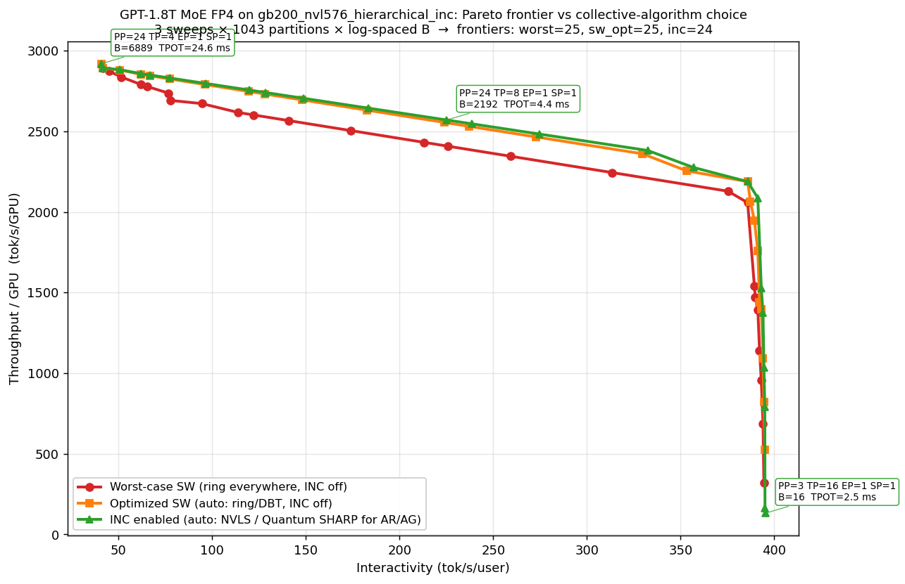
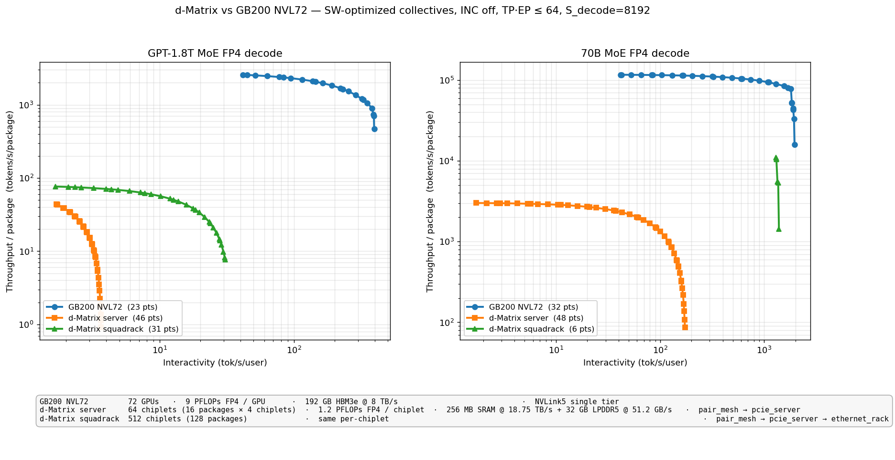

# llm_perf

`llm_perf` is a lightweight, first-principles analytical framework for large-language-model inference performance modeling. It predicts latency, throughput, and memory footprint of LLM inference on a given cluster *before* you build or rent it — from a JSON description of the model, the hardware, the parallelism layout, and a handful of tuning knobs.

The core is a five-stage pipeline (memory → FLOPs → traffic → comm → latency) extended with prefill, end-to-end metric assembly, KV paging, chunked prefill, and disaggregated prefill/decode. Everything is composable pure functions over typed dataclasses — no global state, no training-specific baggage.

---

## Modeled Architecture


The diagram above shows the components of an LLM inference cluster that `llm_perf` models analytically. The system is organized as a disaggregated prefill/decode pipeline with a shared distributed KV cache underneath.

**Serving Framework** sits at the top of the stack — continuous batching, request scheduling, tokenization, KV-aware routing, and per-token detokenization streaming. CPU-side per-request startup ($t_\mathrm{tok}$, $t_\mathrm{sched}$) and per-output-token streaming ($t_\mathrm{detok}$) live here and fold into E2E latency. **Kernel-launch dispatch** ($t_\mathrm{stage,sw}$ — CUDA Graphs replay or eager `cudaLaunchKernel` budget) and the **LM head GEMM + sampling** are GPU-side per-step costs and live in the Decode stack ([`modeling/decode.md §7.1 / §6.2`](documentation/modeling/decode.md)), not here. See [`modeling/framework.md`](documentation/modeling/framework.md).

**Prefill Cluster** is the compute-heavy phase that processes the full input prompt in one (or multiple chunked) forward passes. Each device runs the same transformer layers but at sequence-length `S` rather than single-token decode. Prefill FLOPs scale quadratically with `S` in the attention block and linearly in the FFN/projection layers. See [`modeling/prefill.md`](documentation/modeling/prefill.md) and [`core/prefill_model.py`](llm_perf/core/prefill_model.py).

**Decode Cluster** is the memory-bandwidth-bound autoregressive phase. Devices are connected via a scale-up/out network that carries TP, EP, and SP collectives; pipeline-parallel (PP) stages communicate via point-to-point sends. Data parallelism (DP) replicates the full pipeline to increase throughput without affecting per-request latency. The roofline model inside each device balances compute time against per-token memory read time, and the overlap-aware latency model hides communication behind whichever is the bottleneck. See [`modeling/decode.md`](documentation/modeling/decode.md) and [`core/decode_model.py`](llm_perf/core/decode_model.py).

**Multi-tier memory hierarchy.** Each device exposes an ordered list of memory tiers, fastest first — capacity, peak bandwidth, sustained-BW deflator $\eta_\beta$, and first-byte $\alpha$ per tier. A `MemoryPlacementSpec` on the tuner places weights and KV onto tiers (greedy fastest-first by default, with `auto_priority` controlling the weights-vs-KV tiebreaker; or operator-pinned to a named tier). The decode roofline opens up to a per-tier sum, so SRAM-augmented architectures (Groq LPU, d-Matrix Corsair) and conventional HBM-only GPUs share one model. A single-tier device reproduces the legacy $t_\mathrm{mem} = T_\mathrm{step} / \mathrm{BW_\mathrm{HBM}}$ form bit-for-bit. See [`modeling/sram.md`](documentation/modeling/sram.md) and [`core/memory_placement.py`](llm_perf/core/memory_placement.py).

**KV Transfer** interconnect bridges the two clusters in a disaggregated deployment. When prefill and decode run on separate device groups, the KV cache produced during prefill must be shipped to the decode cluster before autoregressive generation can begin. The transfer cost (startup latency α + bulk BW) is modeled in [`modeling/e2e.md`](documentation/modeling/e2e.md) and can dominate TTFT for short prompts or low-bandwidth fabrics.

**Distributed KV Cache** spans HBM, host DRAM, and SSD tiers. `llm_perf` models PagedAttention-style block accounting — block size, per-sequence block count, internal fragmentation, and effective HBM capacity after subtracting weights and activations — to determine the maximum concurrent-sequence batch a given partition can serve. See [`modeling/kv.md`](documentation/modeling/kv.md) and [`core/kv_paging_model.py`](llm_perf/core/kv_paging_model.py).

The **scale-up/out network** within and between clusters carries collective traffic for tensor parallelism (TP), expert parallelism (EP), and sequence parallelism (SP). The collective cost model accounts for effective per-port bandwidth under aggregate capacity constraints, latency ($\alpha$), and the algorithm choice (ring vs. DBT, dim-decomposed torus, hierarchical RS → sub-AR → AG, plus in-network reduction where the fabric supports it). See [`modeling/collectives/`](documentation/modeling/collectives/) (the upstream-synced explainer subseries — start with `00_summary.md`) and [`core/primitives/collective_cost.py`](llm_perf/core/primitives/collective_cost.py).

**Hierarchical scale-up/out.** Each parallelism domain is described by an ordered list of switching tiers (innermost first), each with its own radix *P*<sub>i</sub>, per-port bandwidth *BW*<sub>i</sub>, and latency *α*<sub>i</sub>. A collective over *G* ranks crosses the minimum number of tiers needed to reach all ranks; multi-tier all-reduce decomposes as inner reduce-scatter → outer sub-AR → inner all-gather, with payload telescoping shrinking the cross-tier traffic. A single-tier list reproduces the legacy flat (*α*<sub>role</sub>, *BW*<sub>role</sub>) model exactly; multi-tier configurations (e.g. NVL72 intra-rack NVSwitch + inter-rack aggregation; d-Matrix `pair_mesh → pcie_server → ethernet_rack` for scale-out across servers) are supported via a `"tiers": [...]` JSON form. See [`modeling/collectives/03_hierarchical_topologies.md`](documentation/modeling/collectives/03_hierarchical_topologies.md) §2 "Composition rules for hierarchical collectives" and `notebooks/pareto_vs_scale_up_tier.ipynb` for a worked example.

---

## Collective & Network Modeling — Upstream Anchor

The collective-communication and network primitives that price every TP/EP/SP/PP collective in this framework — the Hockney α–β cost model, ring/tree/DBT/INC algorithms, hierarchical and torus composition, contention coefficients — are anchored to a dedicated upstream repository: [`spiceMonkey/collective-comm`](https://github.com/spiceMonkey/collective-comm). That repo is the single source of truth for the cost-model derivations and the primitive library; this repo carries read-only mirrors so the inference modeling here stays in lockstep with upstream changes.

Two paths in this repo are auto-synced from upstream:

- [`llm_perf/core/primitives/collective_cost.py`](llm_perf/core/primitives/collective_cost.py) ← `code/core/collective_cost.py` (the α–β primitive library)
- [`documentation/modeling/collectives/`](documentation/modeling/collectives/) ← `documentation/modeling/` (workload-agnostic explainers + cheatsheet)

Both are kept in sync by [`.github/workflows/sync-collectives.yml`](.github/workflows/sync-collectives.yml) (Mondays 06:00 UTC + manual dispatch). Each run lands the upstream snapshot as a PR; the synced code file carries an `AUTO-SYNCED — DO NOT EDIT LOCALLY` banner that the workflow re-prepends on every run. **Refer to the upstream repo for derivations, additional algorithms, contention calibration, and any further reading on the cost model itself.**

llm_perf-specific glue around the synced primitives lives in sibling modules under `llm_perf/core/primitives/` (the per-stage TP/SP/EP/PP aggregator in `stage_aggregator.py`; the topology-aware dispatcher and MoE Dispatch+Combine 2× wrap in `dispatch.py`) and evolves locally — only the upstream-synced primitives are read-only.

---

## Key Modeling Equations

One line per component in the architecture diagram above. Full derivations live in `documentation/modeling/*.md`; this table is a cross-reference, not a second source of truth.

| Component | Key equation(s) | Doc |
|---|---|---|
| Serving Framework | $t_\mathrm{framework} = t_\mathrm{tok} + t_\mathrm{sched} + T_\mathrm{out} \cdot t_\mathrm{detok}$ — CPU-side per-request startup ($t_\mathrm{tok}$, $t_\mathrm{sched}$) + per-output-token streaming ($t_\mathrm{detok}$). Kernel-launch dispatch and LM-head sampling are **GPU-side** and live in the Decode row, not here. | [`framework.md`](documentation/modeling/framework.md) |
| Prefill Cluster | $t_\mathrm{prefill} = t_\mathrm{prefill,local} + \max(0, t_\mathrm{prefill,comm} - \rho \cdot t_\mathrm{prefill,local}) + t_\mathrm{warmup} + t_\mathrm{LM,prefill}$; prefill FLOPs scale as $S$ (FFN/proj) $+ S^2$ (attention); KV traffic scales as $S$; LM head fires once at the end of the traversal on stage $PP{-}1$ | [`prefill.md`](documentation/modeling/prefill.md) |
| Decode Cluster | $t_\mathrm{local}(B) = \max(t_\mathrm{compute}(B), t_\mathrm{mem}(B))$; $t_\mathrm{stage,hw}(B) = t_\mathrm{local} + \max(0, t_\mathrm{comm} - \rho \cdot t_\mathrm{local})$; **kernel-launch dispatch** $t_\mathrm{stage,sw} = \tau_\mathrm{launch} \cdot [(L/PP)(k_c + k_\mathrm{coll}(n_{TP}+n_{SP})) + (L_\mathrm{moe}/PP) k_\mathrm{coll} n_{EP} + k_\mathrm{pp\_hop}]$ composed via $\rho_\mathrm{SW}$; **LM head one-shot** $t_\mathrm{LM,hw}(B)$ on stage $PP{-}1$; **pipeline bubble** $\gamma_\mathrm{pp} = \max(1, PP/B)$. Final: $t_\mathrm{step,user}(B) = \gamma_\mathrm{pp} \cdot [t_\mathrm{stage,hw} + \max(0, t_\mathrm{stage,sw} - \rho_\mathrm{SW} \cdot t_\mathrm{stage,hw})] + t_\mathrm{LM,hw}$. $\mathrm{TPOT} = t_\mathrm{step,user}$. Memory→compute crossover at $B^* = T_\theta \cdot R / (F_\mathrm{token} \cdot \mathrm{BW_\mathrm{eff,0}} - T_\mathrm{kv} \cdot R)$. | [`decode.md`](documentation/modeling/decode.md) |
| Kernel-Launch Overhead | $t_\mathrm{stage,sw} = \tau_\mathrm{launch} \cdot [(L/PP)(k_c + k_\mathrm{coll}(n_{TP}+n_{SP})) + (L_\mathrm{moe}/PP) k_\mathrm{coll} n_{EP} + k_\mathrm{pp\_hop}]$ | [`decode.md §7.1`](documentation/modeling/decode.md) |
| Memory Hierarchy | $t_\mathrm{mem}(B) = \sum_i (T_{\theta_i} + B \cdot T_\mathrm{KV,i}) / \mathrm{BW_\mathrm{eff,i}}$ — multi-tier opening of the decode roofline (single-tier reduction recovers $T_\mathrm{step} / \mathrm{BW_\mathrm{HBM}}$ exactly) | [`sram.md`](documentation/modeling/sram.md) |
| Scale-up/out Network | $t_\mathrm{coll}(M, G) = n_\alpha \cdot \alpha \cdot \eta_\alpha + n_\beta \cdot M / (\mathrm{BW} \cdot \eta_\beta)$ per shipped primitive (Hockney α–β with contention factors $\eta_\alpha \ge 1$, $\eta_\beta \in (0, 1]$); ring/DBT for star AR; dim-decomposed for torus; hierarchical RS → sub-AR → AG with payload telescoping for multi-tier crossbars; INC variants on tiers short-circuit to switch-cut-through $\alpha$ + 1× BW; per-primitive $n_\alpha$, $n_\beta$ | [`collectives/00_summary.md`](documentation/modeling/collectives/00_summary.md) |
| KV Transfer | $t_\mathrm{KV} = \alpha_\mathrm{disagg} + M_\mathrm{KV} / \mathrm{BW_\mathrm{disagg}}$ with $M_\mathrm{KV} = (L/\mathrm{PP}) \cdot 2 S \cdot H_\mathrm{kv} \cdot b$ (0 for co-located) | [`e2e.md`](documentation/modeling/e2e.md) |
| Distributed KV Cache | $N_\mathrm{seq,max} = \lfloor M_\mathrm{avail} / (N_\mathrm{blocks} \cdot M_\mathrm{block} \cdot \varphi_\mathrm{avg}) \rfloor$ where $M_\mathrm{avail} = \mathrm{HBM} - M_\theta - M_\mathrm{act} - M_\mathrm{sys}$ and $\varphi_\mathrm{avg} = 1 + B_\mathrm{blk} / (2 S)$ | [`kv.md`](documentation/modeling/kv.md) |
| E2E Assembly | $\mathrm{E2E}(N_\mathrm{out}) = \mathrm{TTFT} + (N_\mathrm{out} - 1) \cdot \mathrm{TPOT} + t_\mathrm{framework}$; throughput/GPU $= \mathrm{TTPS} / N_\mathrm{GPUs} = B / (t_\mathrm{step,user} \cdot N_\mathrm{GPUs,per-replica})$; interactivity $= 1 / \mathrm{TPOT}$ (per-user; not divided by $B$) | [`e2e.md`](documentation/modeling/e2e.md) |
| SLO & Partition Feasibility | $\mathrm{Goodput} = \max\,\lambda$ s.t. $P_p[\mathrm{TTFT}] \le \mathrm{TTFT_{SLO}}$ and $P_p[\mathrm{TPOT}] \le \mathrm{TPOT_{SLO}}$; **floor** (rules out under-sharded shapes): $T_\theta / \mathrm{BW_{mem}} \le \mathrm{TPOT_{SLO}}$; **TPOT bound** (Zone 3): $B_\mathrm{max} \approx R_\mathrm{GPU} \cdot \mathrm{TPOT_{SLO}} / F_\mathrm{token,device}$; **TTFT bound** (prefill-warmup linearity in PP): $\mathrm{PP_{max}} \approx 1 + (\mathrm{TTFT_{SLO}} - t_\mathrm{sched} - t_\mathrm{prefill,local} - t_\mathrm{step,user}) / t_\mathrm{stage,max}$; dynamic cushion $\overline{B} \ge PP + z_p \sqrt{\overline{B}}$ at percentile $p$ | [`slo.md`](documentation/modeling/slo.md) |

---

## Decode Modeling Flow

> **Start with [`decode.md`](documentation/modeling/decode.md).** It's the most important modeling doc to review — every Pareto sweep, every case study, and the entire `InferenceCalculator` path go through it. The decode roofline assembles compute + multi-tier memory + collective comm + kernel-launch dispatch + LM head + pipeline bubble into a single user-observed step time, and the rest of the framework (prefill, e2e, kv paging) builds on its conventions.


The diagram traces how three JSON inputs (cluster, model, tuning) become a single TPOT number:

1. **Partition** maps the cluster onto a `(PP, TP, EP, SP)` shard layout, with `DP = N / (PP·TP·EP·SP)` filling the remaining device budget.
2. **Per-device traffic & FLOPs** turn model bytes into per-device weight bytes ($T_\theta$), KV bytes ($T_\mathrm{KV}$), and FLOPs ($F_\mathrm{token}$) — this is where the partition's structural choices first hit the rooflines.
3. **Four parallel cost branches** are computed independently from the per-device quantities: memory roofline ($t_\mathrm{mem}$), compute roofline ($t_\mathrm{compute}$), collective communication ($t_\mathrm{comm}$), and kernel-launch dispatch ($t_\mathrm{stage,sw}$).
4. **Assembly funnel** combines them in two overlap stages: HW-side ($t_\mathrm{stage,hw} = t_\mathrm{local} + \max(0, t_\mathrm{comm} - \rho \cdot t_\mathrm{local})$) then SW-side ($t_\mathrm{stage} = t_\mathrm{stage,hw} + \max(0, t_\mathrm{stage,sw} - \rho_\mathrm{SW} \cdot t_\mathrm{stage,hw})$).
5. **Pipeline bubble** ($\gamma_\mathrm{pp} = \max(1, PP/B)$) and **LM head** ($t_\mathrm{LM,hw}$) join at the final assembly: $t_\mathrm{step,user}(B) = \gamma_\mathrm{pp} \cdot t_\mathrm{stage} + t_\mathrm{LM,hw}$.
6. **TPOT** = $t_\mathrm{step,user}$. Interactivity $= 1 / \mathrm{TPOT}$; per-replica throughput $= B / t_\mathrm{step,user}$, scaled by $\mathrm{DP}$ to get cluster TTPS.

Every block in the diagram corresponds to a function in `llm_perf/core/decode_model.py`; every equation has its derivation in `documentation/modeling/decode.md`.

---

## SLO and Partition Feasibility

Production deployments don't run at a single (partition, $B$) point — they run at the largest arrival rate $\lambda$ that keeps both TTFT and TPOT below operator-set service-level objectives (SLOs). Inverting the rooflines of `decode.md` and `prefill.md` against those SLOs produces hard bounds on the partition shape and the operating batch — **the SLO box on the partition node in the flow diagram above is exactly this constraint layer.**

Four bounds, each derived in `slo.md`:

1. **Floor check** — partitions whose per-device weight footprint streams slower than the SLO budget are infeasible at any $B$ and any $\lambda$. The cleanest, most operationally consequential prune; runs first in the partition sweep.
   $$T_{\theta,\mathrm{device}} \,/\, \mathrm{BW_{mem}} \;\le\; \mathrm{TPOT_{SLO}}$$
2. **TPOT-SLO bound on $B$** (Zone-3 closed form) — caps batch size in compute-bound operation. Independent of the per-device weight footprint; depends only on the per-device compute capacity, the per-token FLOPs, and the SLO target.
   $$B_\mathrm{max} \;\approx\; R_\mathrm{GPU} \cdot \mathrm{TPOT_{SLO}} \,/\, F_\mathrm{token,device}$$
3. **TTFT-SLO bound on $PP$** (prefill-warmup linearity) — caps pipeline depth via the first-token traversal cost. The asymmetry that drives most production stacks toward TP-first / shallow-PP.
   $$\mathrm{PP_{max}} \;\approx\; 1 + (\mathrm{TTFT_{SLO}} - t_\mathrm{sched} - t_\mathrm{prefill,local} - t_\mathrm{step,user}) \,/\, t_\mathrm{stage,max}$$
4. **Goodput** (the optimization target) — the maximum sustained arrival rate over the joint feasibility region; goodput-optimal partition is the argmax over the discrete $(PP, TP, EP, SP)$ space.
   $$\mathrm{Goodput} \;=\; \max\,\lambda \quad \text{s.t.} \quad P_p[\mathrm{TTFT}(\lambda)] \le \mathrm{TTFT_{SLO}} \;\wedge\; P_p[\mathrm{TPOT}(\lambda)] \le \mathrm{TPOT_{SLO}}$$

The joint feasibility region $\mathcal{F}_\mathrm{SLO}$, the dynamic-stability cushion ($\overline{B} \ge PP + z_p \sqrt{\overline{B}}$ at percentile $p$), the disaggregated-vs-co-located decision rule when the two SLOs disagree on PP, the goodput-optimal partition sweep recipe, and the workload-class SLO target profiles (chat / agentic / batch) are all in [`slo.md`](documentation/modeling/slo.md).

---

## Repository Layout

```
.
├── README.md                         — this file
├── assets/                           — PNGs embedded in README + notebooks
├── notebooks/                        — interactive tutorial + case studies (Pareto + TTFT sweeps)
│   ├── quickstart.ipynb              — load specs, run the full stack
│   ├── pareto_basic.ipynb            — full (partition, B) exploration space
│   ├── pareto_collective_algorithms.ipynb — worst-case vs optimized SW vs INC
│   ├── pareto_vs_io.ipynb            — decode Pareto × scale-up I/O sweep
│   ├── pareto_vs_mem.ipynb           — decode Pareto × HBM-BW sweep
│   ├── pareto_vs_flops.ipynb         — decode Pareto × peak-FLOPS sweep
│   ├── pareto_tpu_vs_gb200.ipynb     — TPU v5p pod vs GB200 NVL72 × collective algorithm
│   ├── pareto_dm_vs_gb200.ipynb      — d-Matrix vs GB200 NVL72, 1.8T + 70B MoE
│   ├── pareto_vs_cluster_size.ipynb  — decode Pareto × cluster size (N)
│   ├── pareto_vs_scale_up_tier.ipynb — decode Pareto × scale-up tiering
│   ├── pareto_vs_overhead.ipynb      — decode Pareto × framework overhead
│   ├── pp_range_finder.ipynb         — diagnostic for stacking PP-cap constraints
│   ├── scale_up_io_bw_target.ipynb   — closed-form BW_target sweep across (model × partition × B)
│   ├── ttft_vs_io.ipynb              — TTFT × mismatched-partition disagg I/O
│   └── ttft_vs_chunk.ipynb           — TTFT × chunk-size sweep (co-lo)
├── documentation/
│   ├── modeling/                     — methodology derivations
│   │   ├── decode.md                 — decode roofline (compute + multi-tier mem + comm + SW + LM + bubble)
│   │   ├── prefill.md                — prefill latency (incl. chunked + LM head)
│   │   ├── e2e.md                    — TTFT, TPOT, throughput, interactivity, goodput, Pareto
│   │   ├── slo.md                    — SLO-driven partition feasibility (B_max, PP_max, goodput-optimal sweep)
│   │   ├── kv.md                     — paged-attention KV bookkeeping
│   │   ├── framework.md              — CPU-side serving overhead (t_tok, t_sched, t_detok)
│   │   ├── notation.md               — canonical symbol reference (synced with decode/prefill/e2e)
│   │   ├── sram.md, dram3d.md        — multi-tier memory + 3D-DRAM bandwidth derivations
│   │   ├── references.md             — bibliography
│   │   └── collectives/              — upstream-synced explainer subseries (00 cheatsheet through 05 contention)
│   └── explaining/                   — design-intent walkthroughs (PP/TP/EP scaling, kernel-launch, pipeline bubble, FLOPS-doesnt-help, scale-up I/O break-even, …)
├── sandbox/                          — one-off experiments + ad-hoc Python sweeps (not part of supported tooling)
├── scripts/                          — supported CLI tools
│   └── convert_hf_model.py           — HF config.json → llm_perf model JSON converter
├── tests/                            — unit + regression tests (`unit/`, `regression/`)
└── llm_perf/
    ├── calculators/
    │   ├── inference_calculator.py   — decode-phase orchestration
    │   ├── prefill_calculator.py     — prefill-phase orchestration
    │   └── e2e_calculator.py         — TTFT/TPOT/throughput assembly
    ├── core/
    │   ├── memory_model.py           — M_θ, M_act, M_kv, per-tier residency, fit predicate
    │   ├── memory_placement.py       — split T_θ / T_KV across device memory tiers (greedy or pinned); multi-tier t_mem
    │   ├── decode_model.py           — decode FLOPs, traffic, comm, multi-tier roofline + overlap-aware TPOT, B*, t_SW, t_LM, γ_pp
    │   ├── prefill_model.py          — prefill FLOPs, traffic, comm, latency (incl. chunked prefill, LM head)
    │   ├── collective_algo_opt.py    — post-partition resolver for `auto` collective algorithms (per-cell min(cost), INC short-circuit)
    │   ├── kv_paging_model.py        — paged-attention block accounting
    │   └── primitives/               — phase-agnostic physics
    │       ├── weight_footprint.py   — dense / MoE / embedding bytes
    │       ├── kv_footprint.py       — KV cache bytes for n_tokens
    │       ├── linear_flops.py       — proj + FFN + MoE-router FLOPs per token
    │       ├── collective_cost.py    — α–β cost formulas (AUTO-SYNCED from upstream)
    │       ├── dispatch.py           — topology-aware dispatcher (ring/DBT/INC/hierarchical/torus selection)
    │       ├── stage_aggregator.py   — per-stage TP/SP/EP/PP accumulator
    │       └── partition_layout.py   — nested-layout helper for tier-aware PP-hop costing
    ├── database/
    │   ├── model/                    — model JSONs (gpt_1_8t_moe, gpt_70b_moe, llama3.1_*, deepseek_*, qwen3_*, dense_*)
    │   ├── system/                   — system JSONs (gb200.*, gb300.*, h100/h200, tpu.v5p.pod, dmatrix.{server,squadrack}, groq.lpu)
    │   ├── partition/                — partition JSONs (PP/TP/EP/SP)
    │   └── tuner/                    — tuner JSONs (collective algorithms, MemoryPlacementSpec, S_decode, B_decode, kernel_launch_us, ρ_SW, …)
    ├── specs/                        — LlmModelSpec, SystemSpec (DeviceSpec + MemoryTierSpec + FabricSpec + CrossbarTier/TorusTier/MeshTier), PartitionSpec, TuningSpec (+ MemoryPlacementSpec), OverheadSpec, DisaggSpec
    ├── io/                           — JSON loaders + list helpers per schema
    └── utils/                        — constants, equations, HF adapter, DRAM3D helper, plotting, partition_enum
```

### Core modeling code structure

The `llm_perf` package is organized as four concentric layers — each one pure, each one a single-purpose target for reading and extension:

**1. Specs (`llm_perf/specs/`)** — typed dataclasses that describe the problem. `LlmModelSpec` + optional `MoESpec` fix the architecture; `SystemSpec` + nested `DeviceSpec` (+ optional `tiers: List[MemoryTierSpec]` or top-level `sram_capacity_MB` / `sram_bandwidth_TBps` for SRAM-augmented devices) + `FabricSpec` + tier classes (`CrossbarTier`, `TorusTier`, `MeshTier`) fix the hardware and its fabric-chain topology; `PartitionSpec` fixes the parallelism layout (PP / TP / EP / SP); `TuningSpec` carries execution knobs (`S_input`, `S_decode`, `B_prefill`, `B_decode`, `chunk_size`, collective algorithms, overlap factor ρ, plus a `MemoryPlacementSpec` that decides which memory tier holds weights vs KV); `OverheadSpec` and `DisaggSpec` add framework overheads and inter-cluster KV transfer. No behaviour — only data.

**2. Core primitives (`llm_perf/core/primitives/`)** — phase-agnostic physics reused by both decode and prefill. Four modules, each a pure function of specs only: `weight_footprint.py` (dense / MoE / embedding bytes), `kv_footprint.py` (KV bytes for `n_tokens` context), `linear_flops.py` (proj + FFN + MoE-router FLOPs per token, attention excluded), and `collective_cost.py` (α-β cost formulas for p2p-hop, ring/tree all-reduce, ring/tree MoE all-to-all, ring all-gather, plus the per-stage aggregator). Everything downstream composes these.

**3. Core phase models (`llm_perf/core/`)** — the roofline stack, one pure function per step, returning a small result dataclass. `memory_model.py` computes weight / activation / KV footprint, calls `memory_placement.resolve_placement` to split bytes across the device's memory tiers, and exposes a per-tier `M_resident_per_tier` plus a `fits_in_HBM` boolean (legacy name, generalized to "fits in every tier"). `memory_placement.py` is the placement layer for SRAM-augmented architectures (sram.md §1.3, §2.1) — `resolve_placement` returns the per-tier (weights, KV) split under the policy on `MemoryPlacementSpec`, and `t_mem_from_placement` evaluates the multi-tier roofline `Σ_i (T_θ,i + B·T_KV,i) / BW_eff,i` consumed by both `decode_model` and `prefill_model`. `decode_model.py` wires primitives with decode-specific attention (4·S·H per token) and single-token messages, exposing `compute_flops / compute_traffic / compute_comm / compute_latency`; the latency step routes through the multi-tier helper, so single-tier devices reproduce the legacy `T_step / BW_HBM` numbers exactly. `prefill_model.py` mirrors that shape with prefill-specific physics: S²-attention, S-scaled messages, pipeline warmup, and a chunked-prefill loop that re-prices comm at `tokens_per_step=C` per chunk. `collective_algo_opt.py` resolves `auto` placeholders on `TuningSpec` after the partition is fixed, picking `min(cost)` per (phase × collective × G × M) and short-circuiting to INC when the fabric supports it. `kv_paging_model.py` accounts for PagedAttention-style block allocation and fragmentation to derive max concurrent sequences.

**4. Calculators (`llm_perf/calculators/`)** — thin orchestrators that stitch the phase models into user-facing workflows: `InferenceCalculator` (decode end-to-end), `PrefillCalculator` (prefill end-to-end incl. batched / chunked), and `E2ECalculator` (TTFT = prefill + overhead + disagg KV transfer; TPOT from decode; E2E(N_out); throughput/GPU; interactivity). Each returns a single aggregate result dataclass you can inspect field-by-field.

**Dataflow.** Every call is `(specs) → primitives → phase-model pure functions → calculator result`. No global state, no side effects, no I/O in the hot path — JSON loaders in `llm_perf/io/` are only touched once at spec-construction time. This is what makes the pipeline safe to sweep inside tight notebook loops: you can call a calculator thousands of times across `(partition, tuner)` grids without contention or setup cost.

**Extending.** Adding a new spec field is a dataclass edit + loader pass-through. Adding a new collective algorithm (e.g. `tree_all_reduce`) means adding a function in `core/primitives/collective_cost.py` and dispatching to it by name in the `compute_comm` branch of the phase models. Adding a new model or system is a JSON drop into `llm_perf/database/` — no code change required.

---

## Quickstart

```bash
python -m venv .llm_perf
source .llm_perf/bin/activate
pip install jupyter matplotlib numpy
jupyter notebook notebooks/quickstart.ipynb
```

The quickstart walks through discovery, loading, running `InferenceCalculator`, and inspecting the memory/FLOPs/traffic/comm/latency breakdown.

### Programmatic usage

```python
from llm_perf import InferenceCalculator
from llm_perf.calculators.prefill_calculator import PrefillCalculator
from llm_perf.calculators.e2e_calculator import E2ECalculator
from llm_perf.io import load_model_spec, load_system_spec, load_tuning_spec
from llm_perf.specs.partition_spec import PartitionSpec
from llm_perf.specs.overhead_spec import OverheadSpec
from llm_perf.specs.disagg_spec import DisaggSpec

model     = load_model_spec("llm_perf/database/model/gpt_1_8t_moe.json")
system    = load_system_spec("llm_perf/database/system/gb200.72gpu.json")
tuner     = load_tuning_spec("llm_perf/database/tuner/gpt_1_8t_moe.tuner.json")
partition = PartitionSpec(PP=8, TP=8, EP=1, SP=1)
tuner.S_input, tuner.S_decode, tuner.B_decode = 8192, 8192, 1

decode   = InferenceCalculator(model, system, partition, tuner).run()
prefill  = PrefillCalculator(model, system, partition, tuner).run()
e2e      = E2ECalculator(
    decode, prefill,
    overhead=OverheadSpec(t_graph_us=100.0),   # CUDA graph overhead
    disagg=DisaggSpec(),                        # co-lo, matched partition
    model=model, system=system, partition=partition, tuner=tuner,
).run()

print(f"TTFT       = {e2e.TTFT*1e3:.1f} ms")
print(f"TPOT       = {e2e.TPOT*1e3:.2f} ms")
print(f"tok/s/GPU  = {e2e.throughput_per_gpu:.1f}")
```

---

## Case Studies

Each notebook is a self-contained design question with a plot and a short takeaway. They're meant as reading material — a reader can step through the cells to understand how a specific decision (partition, I/O BW, HBM BW, overhead, chunk size, disagg) shapes the end-to-end metric that matters.

The case studies use **GPT-1.8T MoE @ FP4** on **GB200-class devices** (NVL72 baseline; cluster-size study extends past 72 GPUs hypothetically). The TPU-vs-GB200 study is the one exception — it compares a TPU v5p pod against GB200 NVL576 to isolate fabric-topology and AR-algorithm effects.

> **Operational PP cap.** All `pareto_*` notebooks pin **`PP_MAX = 8`** in cell #5 — the typical PP-capped operational regime where pipeline bubble cost / latency budget / microbatch-floor make deeper PP impractical. Raise `PP_MAX` in any notebook to study the unbounded-PP frontier (winners shift toward `PP=32 TP=2`-style shapes that amortize attention more efficiently at the cost of longer pipelines).

### `notebooks/pareto_basic.ipynb` — the full exploration space behind the frontier


*Question: where does the Pareto frontier come from? What does the underlying point cloud look like?*

Enumerates every valid `(PP, TP, EP, SP)` partition, sweeps `B` from 1 to the KV-paging max per partition, then extracts the upper-right envelope in (interactivity, throughput/GPU) space. Left panel shows the full cloud with the frontier overlaid; right panel colors the same cloud by pipeline parallelism (PP) so the regime segmentation is visible.

**Headline:** at baseline GB200 NVL72 under the operational `PP_MAX = 8` cap (consistent across the entire `pareto_*` notebook suite), **260 valid partitions → 37 frontier points**. Of those 37, `PP=8 TP=8 EP=1 SP=1` claims 33 (the dominant winner — PP=8 amortizes weight reads as much as the cap allows, TP=8 is the largest group that fits in a single NVL5 rank slot per AR), and `PP=6 TP=4 EP=1 SP=1` rounds out the high-interactivity corner with 4. The §8 latency-breakdown table dumps per-collective costs ($t_\mathrm{compute}$, $t_\mathrm{mem}$, $t_\mathrm{TP}$, $t_\mathrm{SW}$, $t_\mathrm{LM}$, $\gamma_\mathrm{pp}$) for every frontier point so you can read the regime directly. The later notebooks (`pareto_vs_io`, `pareto_vs_mem`, `pareto_vs_overhead`) re-run this exact enumeration once per hardware/overhead anchor and plot only the frontier — this notebook is what's underneath.

To compare against the unbounded-PP regime (PP up to 32 — the `pareto_basic` historical setup), raise `PP_MAX` in cell #5; winners then shift toward `PP=32 TP=2`-style shapes that amortize attention more efficiently at the cost of longer pipelines.

### `notebooks/pareto_collective_algorithms.ipynb` — worst-case vs optimized SW vs INC on the same hardware



*Question: how much does the choice of collective algorithm move the decode Pareto frontier on a fixed cluster?*

Three frontiers, same model + system, only the `TuningSpec` algorithm fields and `inc_enabled` flag differ:

1. **Worst-case SW** — pin every collective to ring; `inc_enabled=False`. The do-nothing baseline (red).
2. **Optimized SW** — `tp/ep_algorithm_*='auto'` + `optimize_collective_algorithms` resolves per (phase × collective × M); `inc_enabled=False`. Picks DBT vs ring per cell (orange).
3. **INC** — `auto` fields + `inc_enabled=True`. Optimizer short-circuits to NVLS / Quantum SHARP for AR / AG where the fabric supports it (EP A2A still on SW pairwise — sharp_class doesn't accelerate A2A; would need a `hw_a2a` tier) (green).

System: `gb200.nvl576.hierarchical.inc` (576 GPUs, NVLink5 + IB, NVLS + Quantum SHARP declared on both tiers).

**Headline at the corners** (under the operational `PP_MAX = 8` cap; cluster spans tier-1 IB so collectives can cross the rack boundary):

| Corner | Mode | Partition | B | TPOT (ms) | tput/GPU |
|---|---|---|---|---|---|
| high interactivity | worst | `PP=8 TP=8 EP=8 SP=1` | 8 | 0.70 | 19.7 |
| | sw_opt | `PP=8 TP=16 EP=4 SP=1` | 8 | 0.47 | 29.8 |
| | inc | `PP=8 TP=16 EP=4 SP=1` | 8 | 0.42 | 33.2 |
| mid frontier | worst | `PP=8 TP=16 EP=1 SP=1` | 560 | 3.09 | 1259 |
| | sw_opt | `PP=6 TP=16 EP=1 SP=1` | 534 | 3.35 | 1660 |
| | inc | `PP=6 TP=16 EP=1 SP=1` | 534 | 3.21 | 1735 |
| high throughput | worst | `PP=8 TP=8 EP=1 SP=1` | 4096 | 24.86 | 2575 |
| | sw_opt | `PP=8 TP=8 EP=1 SP=1` | 4477 | 25.72 | 2720 |
| | inc | `PP=8 TP=8 EP=1 SP=1` | 4477 | 25.64 | 2728 |

Under the PP=8 cap, the optimizer can no longer amortize via deep PP, so it activates **EP-sharding** (EP=4/8 winners emerge at the high-interactivity corner). The cheaper AR cost from `sw_opt` and `inc` lets the optimizer afford TP=16 + EP=4 — sacrificing throughput for lower TPOT (0.42 ms with INC vs 0.70 ms for `worst`). Mid- and high-throughput corners converge as compute starts dominating comm at large B. With `TP=16` exceeding the 72-port NVL5 inner tier when combined with EP=4 (TP·EP = 64), the multi-tier hierarchical AR / AG branch begins firing, and INC's lift is both the `n_α` collapse + BW-eff doubling on AR plus the cross-tier RS → sub-AR → AG payload-telescoping savings. EP A2A still uses the SW path on `sharp_class` fabrics.

### `notebooks/pareto_vs_io.ipynb` — decode Pareto under scale-up I/O provisioning


*Question: how does the partition-optimal Pareto frontier move as you vary scale-up NVLink bandwidth and α?*

Sweeps BW (`[1×, 2×, 10×, 20×]` × baseline = 900 GB/s → 18 TB/s, well past HBM-class scale-up) and α (`[1×, 0.5×, 0.25×, 0×]` × baseline = 0.5 μs → complete elimination) as two panels. Enumerates all valid (PP, TP, EP, SP) partitions under the PP=8 cap, finds the upper-right envelope in (interactivity, throughput/GPU) space, annotates winners.

**Headline:** **BW alone — even at 20× current — cannot trigger a partition-shape change.** `PP=8 TP=8 EP=1 SP=1` exclusively wins all 36 frontier corners at every BW from 1× through 20×; the optimizer's bias toward smaller TP outweighs the per-device weight savings of TP=16 even when scale-up BW is HBM-class. **α elimination alone partially activates wide-TP** — the α sweep is flat through 0.25×, but at α=0 (complete elimination) `PP=4 TP=16 EP=1 SP=1` emerges (6 corners) because the per-collective `2(G−1)·α` cost at G=16 is the structural latency floor. The ideal-I/O reference (BW→∞, α→0, ρ=1) wins `PP=4 TP=16` at 39/40 corners — getting *all three* knobs simultaneously is what fully shifts the frontier. **BW boost is necessary but not sufficient** for wide-TP wins: it makes those shapes affordable in absolute terms (β-side `t_comm` shrinks proportionally), but α reduction or ρ overlap improvement is also required to actually flip the winner.

For the closed-form theory behind this — and a sandbox script that computes the BW threshold $BW^* (B) = b_p(B) / (f \cdot t_\mathrm{mem}(B) - a_p \cdot \alpha)$ for any (model, partition, B) — see [`documentation/explaining/scale_up_io_break_even.md`](documentation/explaining/scale_up_io_break_even.md) and the companion [`notebooks/scale_up_io_bw_target.ipynb`](notebooks/scale_up_io_bw_target.ipynb).

### `notebooks/pareto_vs_mem.ipynb` — decode Pareto under HBM-BW scaling


*Question: as HBM bandwidth grows (DRAM-3D / stacked-memory trajectory), which partition wins?*

Sweeps HBM BW from 1× (8 TB/s, baseline) to 4× (32 TB/s) at fixed scale-up I/O and FLOPS.

**Headline:** under the PP=8 cap, the partition shape **evolves with HBM** (in contrast to the unbounded-PP regime where TP stays pinned at 2). With abundant HBM, the optimizer accepts a smaller TP group (cheaper per-collective AR) and reaches for EP-sharding to free up SRAM headroom.

| HBM BW | Dominant winner (×points on frontier) |
|---|---|
| 1× (8 TB/s)  | `PP=8 TP=8 EP=1 SP=1` × 33 |
| 2× (16 TB/s) | `PP=8 TP=8 EP=1` × 28; `PP=8 TP=4 EP=2` × 3 emerges |
| 4× (32 TB/s) | `PP=8 TP=8 EP=1` × 18; `PP=8 TP=4 EP=2` × 9; `PP=8 TP=4 EP=1` × 8 |
| ideal (∞)   | `PP=8 TP=1 EP=1` × 10; `PP=6 TP=1 EP=1` × 8 — TP collective is pure overhead |

Scarce HBM favors wide TP to parallelize weight reads; abundant HBM makes the TP collective pure overhead and activates EP for the MoE-FFN slice. **Practical implication:** under the operational PP cap, a partition tuned for today's HBM may need adjustment as HBM scales 2-4× — re-run the partition-optimal sweep when the fabric upgrades.

### `notebooks/pareto_vs_flops.ipynb` — decode Pareto under peak-FLOPS scaling


*Question: if GPU peak FLOPS grew without any change to HBM or scale-up I/O, how much further would the decode Pareto frontier push?*

Sweeps peak FLOPS from 0.5× (H100-class ~4.5 PF) to 4× (~36 PF) at fixed HBM (8 TB/s) and scale-up I/O, plus an `ideal compute` (FLOPS → ∞) reference. Runs the same sweep at two context lengths to expose the regime boundary.

**Headline (split by regime; under PP=8 cap, dominant winner `PP=8 TP=8 EP=1 SP=1`):**

- **At `S`=8192 (left): all five curves overlap exactly** — peak FLOPS is a non-knob. `t_mem / t_compute` is 6×–1400× across every `B`, so the memory-bound asymptote pins the frontier. More FLOPS only widens the machine balance point further from the workload's per-`B` arithmetic intensity.
- **At `S`=1024 (right): the right corner fans out** — shorter context shrinks `T_kv`'s slope in `B` ~8×, pushing per-`B` AI above GB200's 1125 FLOPs/byte balance. At `B`=8192 on 1× FLOPS the step flips compute-bound; 4× FLOPS then lifts high-`B` throughput/GPU from ~7500 → ~9400 (~25% gain), tracing the ideal-compute ceiling.

**Complementary read with `pareto_vs_mem`:** at long `S` this workload is memory-bound end-to-end, so HBM BW moves both corners and FLOPS moves neither. At short `S`, the corners split — memory BW still drives the high-interactivity corner, FLOPS drives the high-throughput corner.

**Prefill / training are the opposite regime** — their attention compute grows as `S²` while KV traffic grows as `S`, putting arithmetic intensity orders of magnitude above any hardware balance point. FLOPS is the primary knob for TTFT and for training throughput. See `documentation/explaining/why_flops_doesnt_help_at_long_context.md` for the full AI / slope derivation and the decode-vs-prefill-vs-training contrast, and `documentation/explaining/frontier_convergence_at_high_b.md` for the $B^*$ story.

### `notebooks/pareto_tpu_vs_gb200.ipynb` — TPU v5p pod vs GB200 NVL72 across collective algorithms


*Question: how does the (throughput/GPU, interactivity) frontier differ between a large 3D-torus pod and a single-rack NVLink crossbar, and how much does the choice of collective algorithm move it on each?*

Four frontiers on one figure for GPT-1.8T MoE @ FP4, `S_decode=8192`: **TPU v5p pod** (4096 devices, 16³ torus) with stock flat-ring fallback vs. optimizer-driven dispatch (greedy dim-align + `auto`); **GB200 NVL72** (72 devices, single-tier NVLink crossbar) with manual worst-case ring vs. optimizer-driven dispatch (`auto` resolves per-cell to DBT at this G/M regime). The optimizer is `core/collective_algo_opt.optimize_collective_algorithms` — runs once per `(partition, B)`, calls `enumerate_options` per (phase × collective), picks `min(cost)`. Per-system sweeps enumerate every valid `(PP, TP, EP, SP)` partition and `B ∈ [1, 256]`, extract the upper-right envelope, and overlay all four frontiers. The device-count asymmetry (4096 vs 72) is intentional — the y-axis (throughput/**GPU**) and x-axis (interactivity = 1/TPOT) are per-device/per-user, so the comparison is about what each fabric squeezes out of a single device, not about aggregate pod capacity.

**Headline (under `PP_MAX = 8` cap):** **GB200 wins peak throughput/GPU ~3× (1305 vs 429 tok/s/GPU)** — reflecting both per-device FLOPS (9000 vs 459 TF) and HBM bandwidth (8 TB/s vs 2.8 TB/s). **TPU wins peak interactivity by ~3.2× (646 vs 201 tok/s)** — not for fabric reasons but because a 4096-device pod admits much wider weight sharding (`PP·TP·EP·SP` up to 32 at the interactivity corner with the PP=8 cap), whereas NVL72's 72-way factorization caps replica at the cluster-fit limit, leaving each device with proportionally more weight to stream per token. The decode interactivity corner is HBM-BW-bound, and at B=1 the corner TPOT ~ `M_θ / (replica · BW_HBM)` — the pod's sharding headroom dominates. **The optimizer barely moves either frontier at the peak corners** (within 1% of the manual baselines): GB200's optimized frontier matches DBT (the optimizer correctly picks `tree` over `ring` at G ≤ 16 where α dominates, then merges with ring once BW dominates at large M); TPU's optimized frontier matches dim-ring with greedy align (torus has only one shipped algorithm, so the optimizer's job is just to confirm `torus-dim-ring`). The visible gap is on non-prefix-aligned partitions (TPU flat-ring fallback) and ring's α-cost on GB200 at small B. The lesson: collective-algorithm choice moves a frontier only when the regime is α-bound *and* the group size exposes the scaling-order difference; at either memory-bound corner it's the fabric's *size headroom* — how wide you can shard — that decides interactivity.

### `notebooks/pareto_dm_vs_gb200.ipynb` — d-Matrix LPDDR5+SRAM cluster vs GB200 NVL72



*Question: how does d-Matrix's SRAM-augmented LPDDR5 fabric (`sram.md` §3.2-§3.3) stack up against GB200 NVL72 across a 1.8T-class and a 70B-class MoE workload — does the SRAM-residency story actually win when the model fits, and how badly does it lose when it doesn't?*

Three systems on the same axes: **GB200 NVL72** (72 GPUs · 192 GB HBM3e @ 8 TB/s · NVLink5), **d-Matrix server** (64 chiplets / 16 packages × 4 chiplets · 256 MB SRAM @ 18.75 TB/s + 32 GB LPDDR5 @ 51.2 GB/s per chiplet · `pair_mesh → pcie_server`), **d-Matrix squadrack** (512 chiplets / 128 packages · same per-chiplet device · `pair_mesh → pcie_server → ethernet_rack`). Two models: **GPT-1.8T MoE FP4** (~0.9 TB weights) and a synthesized **70B MoE FP4** (~35 GB weights, Llama-3-shape attention + Mixtral-style 8-expert top-2). Constraints: **`PP_MAX = 8`** (consistent across the suite), per-system natural scale-up cap (NVL72 → TP·EP ≤ 72; d-Matrix server → 64; squadrack → 512), SW-optimized collectives via `optimize_collective_algorithms`, **INC off** everywhere (NVLS off on GB200 for fairness; d-Matrix has no SHARP-class fabric anyway). Throughput is reported per **package** (1 GPU on GB200; 4 chiplets = 1 Corsair half-card on d-Matrix) so per-device numbers compare like-for-like.

**Headline:** the SRAM-residency advantage only shows up when the model fits.

- **1.8T (left panel):** GB200 NVL72 dominates throughout (~10²-10³ tok/s/pkg vs ~10⁰-10² for d-Matrix). The 1.8T model exceeds aggregate SRAM on both d-Matrix sizes, so weights stream from LPDDR5 and the per-token weight load swamps everything. d-Matrix server frontier saturates at ~13 tok/s/pkg; squadrack adds a small cross-server gain (~68 tok/s/pkg) thanks to deeper PP shapes that fit more weight bytes per chiplet without crossing tiers.
- **70B (right panel):** d-Matrix squadrack reaches the high-interactivity corner via SRAM-resident weight sharding — at sufficiently wide TP and the PP=8 cap, the 35 GB weight footprint shards small enough to fit each chiplet's portion in the 256 MB SRAM tier. Per-token weight load then drops by the SRAM/LPDDR5 bandwidth ratio (~370×). d-Matrix server only has 64 chiplets, so it can't shard small enough to fit weights in SRAM at PP=8 and stays LPDDR5-bound. GB200 NVL72 still wins peak throughput at the throughput-corner (HBM3e is the better fit for the GB200 die area).

**Reading from the curves:** SRAM-residency is a partition-shape question, not just a raw-bandwidth comparison. The optimizer drives interactivity-targeted partitions toward the SRAM-resident regime when the model fits; for models that can't shard small enough to fit SRAM (the 1.8T case), the system reverts to the LPDDR5-bound regime and per-package throughput trails GB200 by ~30×. See `documentation/modeling/sram.md` §3 for the underlying multi-tier roofline that drives both behaviors and `auto_priority` for the weights-vs-KV greedy tiebreaker.

### `notebooks/pareto_vs_cluster_size.ipynb` — decode Pareto under cluster-size scaling


*Question: as the cluster grows from 64 to 1024 GPUs (per-device hardware held fixed), how does the frontier shift — and what happens when larger fabrics lose effective bandwidth?*

Enumerates every valid `(PP, TP, EP, SP)` partition with `PP·TP·EP·SP ≤ N` for each `N ∈ {64, 128, 256, 512, 1024}`, sweeps `B` per partition, extracts the frontier per `N`. Solid curves assume ideal fabric (η=1.0); dashed curves apply a diminishing fabric efficiency η for large clusters (η=0.90 at N=256, 0.80 at N=512, 0.70 at N=1024) to model head-of-line blocking, buffering contention, and protocol overhead at scale.

**Headline (under PP=8 cap):** PP saturates at 8 immediately for both models, so the scaling lever shifts to TP, EP, and DP as N grows. For GPT-1.8T MoE, TP scales 1 → 2 → 4 → 8 → 16 (model cap); past `N=128` the optimizer activates EP-sharding (EP=2 → 4 → 8) for the high-interactivity corner. For DeepSeek-R1, TP caps at 4 (n_kv=5), so its scaling lever past N=128 is necessarily **EP** — the architecture-prediction now plays out cleanly under the operational cap.

GPT-1.8T MoE winner pattern (representative dominant shapes per N):

| N    | Top winners (× corners) |
|------|-------------------------|
| 64   | `PP=8 TP=8 EP=1 SP=1` (×36) |
| 128  | `PP=8 TP=16 EP=1` (×20), `PP=8 TP=8 EP=2` (×11), `PP=8 TP=8 EP=1 DP=2` (×11) |
| 256  | `PP=8 TP=16 EP=1 DP=2` (×17), `PP=8 TP=8 EP=4` (×11) |
| 512  | `PP=8 TP=16 EP=1 DP=4` (×17), `PP=8 TP=8 EP=8` (×10) |
| 1024 | `PP=8 TP=16 EP=1 DP=8` (×17), `PP=8 TP=8 EP=8 DP=2` (×10) |

Device utilization is the silent cost — `DP = N // replica` is floored, so partitions whose replica doesn't divide `N` waste devices. All listed `N` land on 100% util shapes here. Diminishing η at large N pulls the frontier inward — the gap between ideal and η-discounted grows with cluster size, quantifying the cost of fabric inefficiency.

**Cross-model comparison — DeepSeek-R1 on the same sweep:**


DeepSeek-R1 has a very different lever profile: `n_experts=256` makes EP a headline capability, `n_kv=5` keeps TP capped at 4. Under the PP=8 cap, the architecture-prediction holds: DSR1's winning shapes are `PP=8 TP=4 EP=k` with k=1,2,4,8,16 as N grows (versus GPT's TP=8/16 + EP=1/2/4/8 mix). EP=16 emerges as a frontier winner at `N=512` (×12 corners); both models share the rule "**PP=8 cap activates EP as a frontier lever**" — exactly the EP-vs-PP dynamic explored in `pareto_basic`'s discussion (when PP can't grow further, EP is the next-best lever).

### `notebooks/pareto_vs_overhead.ipynb` — decode Pareto under framework overhead


*Question: how does per-step framework overhead (Python scheduler, CUDA graph replay, sampling, detokenization) bend the frontier? Does it change which partition wins?*

Applies framework overhead post-hoc — runs the hardware sweep once per partition, then re-prices per overhead value. Six anchors map to real serving stacks:

| `t_oh` | Framework regime |
|---|---|--------------------|
| 0 μs | Ideal / theoretical lower bound |
| 100 μs | TensorRT-LLM / SGLang / vLLM v1 (CUDA graphs + persistent + async scheduler) |
| 500 μs | Production vLLM / well-tuned TGI (CUDA graphs + continuous batching) |
| 1 ms | vLLM v0 / default TGI (partial graph capture) |
| 2 ms | Eager-mode serving or heavy Python scheduler |
| 5 ms | Unoptimized HF `generate()` loop |

**Headline:** overhead is an **asymmetric tax** — it crushes the high-interactivity (small B) corner but barely moves the high-throughput corner. Despite that, the winning partition at every corner is **stable** across all six overhead values — overhead shifts you along the frontier but does not re-order partition choice.

### `notebooks/ttft_vs_io.ipynb` — mismatched-partition disaggregation: does it pay off?


*Question: if prefill and decode clusters use different partitions (prefill shape optimized for its compute profile, decode shape optimized for its own), when does the KV handoff cost get paid back by faster prefill?*

Fixes decode partition at `PP=8 TP=8 EP=1 SP=1` (the decode-Pareto winner) and compares two mismatched prefill shapes vs. co-lo reference across the **2–32k commercial prompt band** (anchored to ShareGPT / Splitwise / DistServe / Mooncake traces):

- **Mismatch A** — wide-TP prefill (`PP=1 TP=16 EP=4`): PP/TP/EP **all differ** from decode.
- **Mismatch B** — MoE-EP prefill (`PP=2 TP=8 EP=4`): PP+EP differ; TP matches.

Sweeps inter-cluster BW (50 GB/s → 3.6 TB/s) and α (0.5 μs → 5 ms) as two panels.

**Headline:** in the 2–32k commercial band, **mismatched-partition disagg doesn't pay off** — at any BW, at any α. Compute savings from the mismatched prefill partitions are 0.4–8 ms; the KV handoff tax exceeds those savings everywhere. The win case is long-context (64k+) workloads (Mooncake P99 territory) where wide-TP prefill's attention-FLOP savings materialize. For the bulk of commercial traffic, matched-partition co-lo — or disagg-with-matched-partition for scheduling benefits — is the simpler choice.

### `notebooks/ttft_vs_chunk.ipynb` — chunked prefill sweet-spot


*Question: what chunk size minimizes TTFT for chunked prefill, and how does the sweet spot shift with prompt length?*

Fixes partition at `PP=8 TP=8 EP=1 SP=1` (co-lo, matched). Sweeps chunk size log-spaced from 128 tokens up to `S_input` across the same 2–32k band.

**Headline:** a sweet spot of `C* ≈ 2–4k` tokens across the entire commercial band — 2k at 2k prompts, shifting to 4k for 4k+ prompts.

| S_input | Workload | C\* | n_chunks | TTFT\* | vs. single-pass |
|---|---|---|---|---|---|
| 2k | chat+hist     | 2048 | 1 | 3.8 ms   | 5.4× |
| 4k | code/RAG      | 4096 | 1 | 7.6 ms   | 5.5× |
| 8k | prod+RAG      | 4096 | 2 | 15.4 ms  | 5.7× |
| 16k | long-doc     | 4096 | 4 | 32.0 ms  | 6.1× |
| 32k | reason/agent | 4096 | 8 | 68.5 ms | 6.7× |

The U-shape is genuine — small C (128) pays `n_chunks × T_θ` weight re-reads; large C pays quadratic attention; optimum sits near 2–4k tokens. A single hard-coded `C = 2–4k` is within 5–10% of optimal across the full band, so production engines don't need per-request tuning. Most of the headline speedup is from avoiding the PP warmup tax that single-pass prefill pays fully; within the chunked regime itself the win is a more modest ~1–3%.

---

## Utilities

**HuggingFace Adapter** — converts any HuggingFace `config.json` (including MoE and GQA variants) into the `llm_perf.model` schema so it can be used directly with the calculators. Available as a library call (`convert_hf_config_to_model_json()`) or as a CLI script (`python scripts/convert_hf_model.py`). See [`utils/hf_model_adapter.py`](llm_perf/utils/hf_model_adapter.py).

**DRAM3D Bandwidth Calculator** — derives HBM bandwidth from physical die-interface parameters (die area, bump pitch, data-pin fraction, data rate, number of dies) to evaluate future memory classes (HBM3E, HBM4, HBM4E) before silicon is available. Can also update an existing `database/system/*.json` file in place with the computed bandwidth. See [`utils/dram3d.py`](llm_perf/utils/dram3d.py) and [`modeling/dram3d.md`](documentation/modeling/dram3d.md).

---

## Contributing

- Open issues or PRs for new spec types, adapters, or analytical improvements.
- Keep JSON schemas backward compatible when possible.
- Run the quickstart notebook after large changes to confirm the pipeline still loads and runs.

---

## License

MIT — see [LICENSE](LICENSE).
