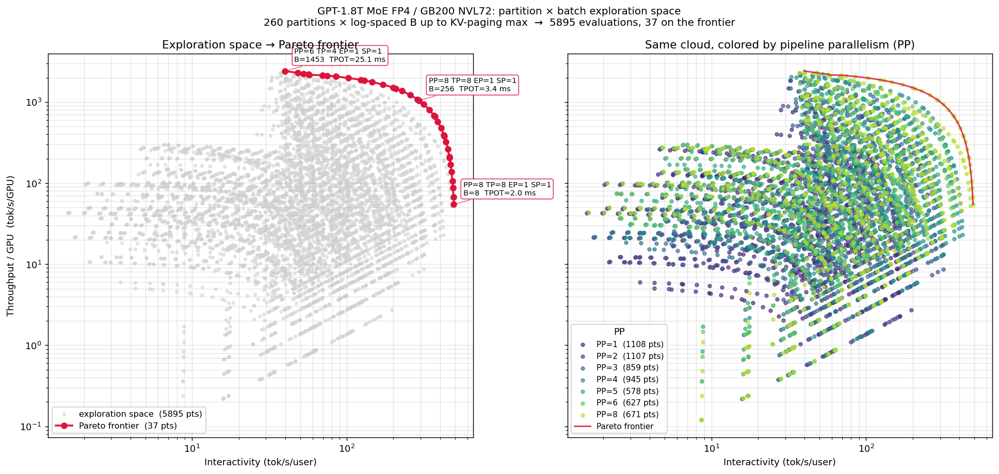
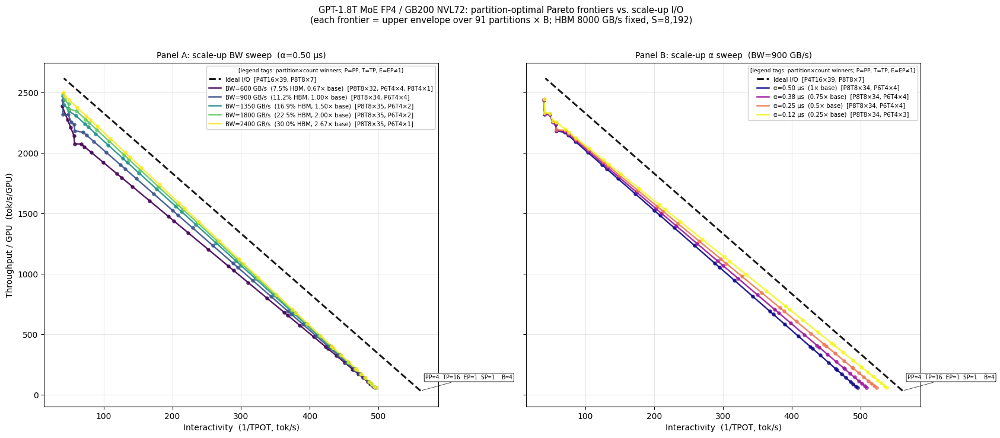
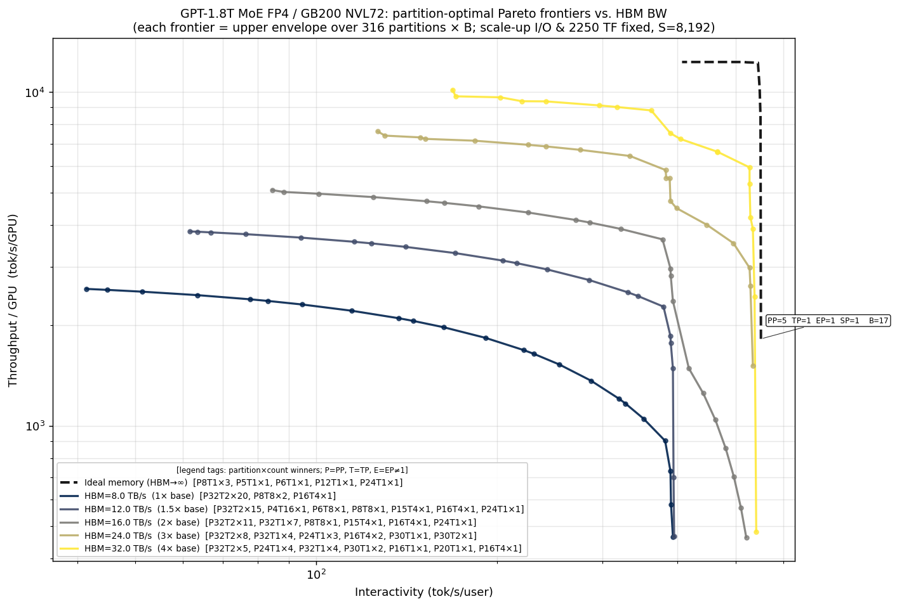
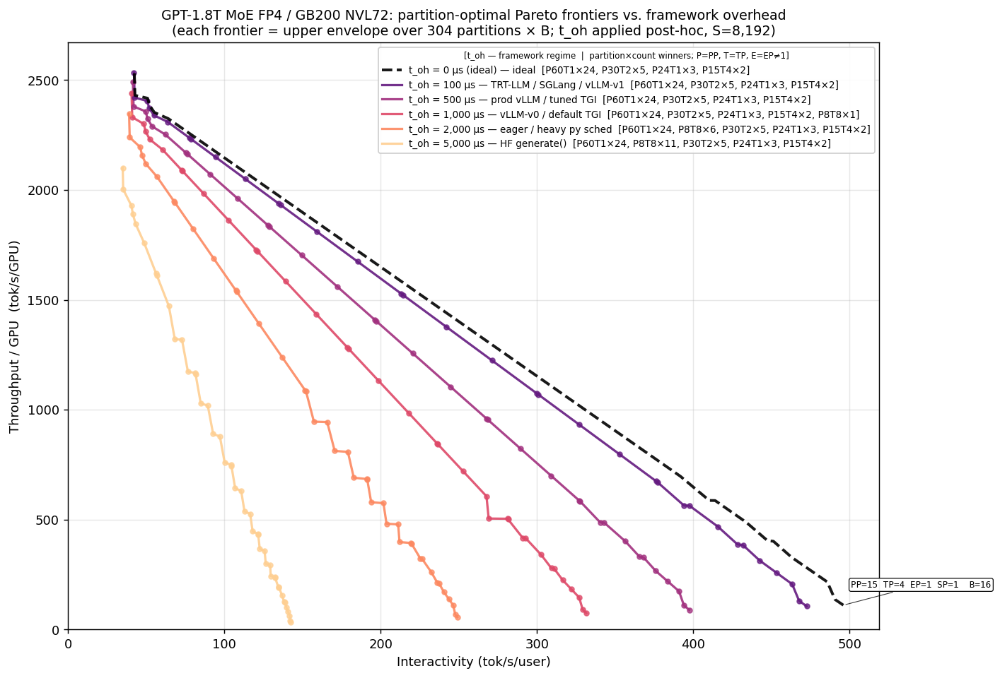
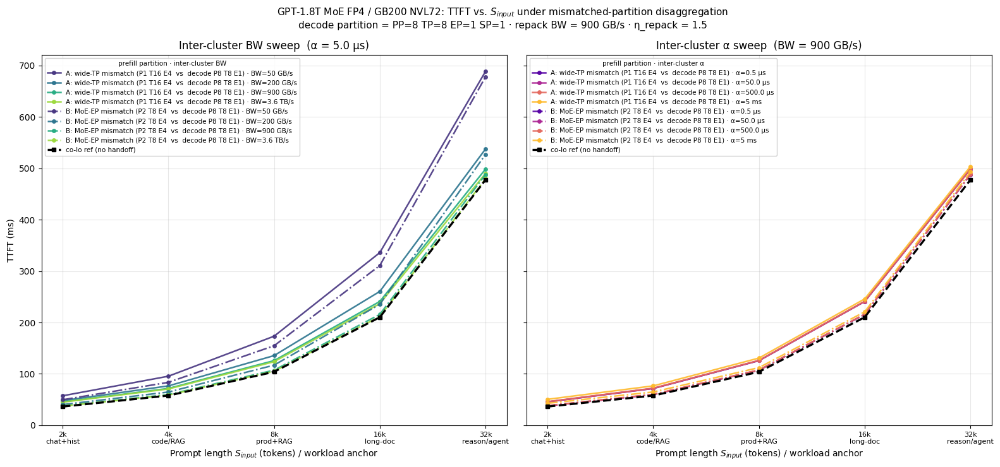
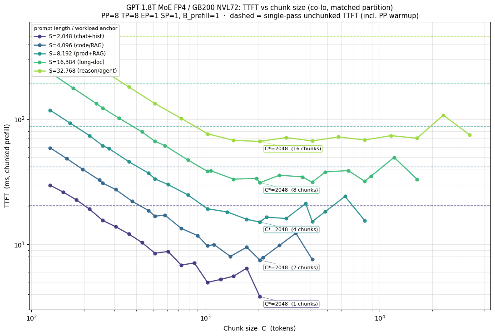

# llm_perf

`llm_perf` is a lightweight, first-principles analytical framework for large-language-model inference performance modeling. It predicts latency, throughput, and memory footprint of LLM inference on a given cluster *before* you build or rent it — from a JSON description of the model, the hardware, the parallelism layout, and a handful of tuning knobs.

The core is a five-stage pipeline (memory → FLOPs → traffic → comm → latency) extended with prefill, end-to-end metric assembly, KV paging, chunked prefill, and disaggregated prefill/decode. Everything is composable pure functions over typed dataclasses — no global state, no training-specific baggage.

## Capabilities

- **Decode-phase pipeline** — memory residency, FLOPs, HBM traffic, scale-up collectives, roofline + overlap-aware latency. Batch-parameterized (B>1) with B\* crossover and TPOT.
- **Prefill pipeline** — analogous stack for prompt processing, with pipeline warmup, **batched prefill**, and **chunked prefill** (per-chunk `C` loop with quadratic attention and re-read weights).
- **End-to-end metric assembly** (`E2ECalculator`) — TTFT (single-pass or chunked) + TPOT + throughput/GPU + interactivity, with framework overhead and KV-handoff costs folded in.
- **Disaggregated prefill/decode** (`DisaggSpec`) — models inter-cluster KV transfer (BW + α + RDMA WR overhead), decode-side repack (partition-reshuffle η), and prefill↔transfer overlap (ρ_KV). Switches cleanly between co-located and disaggregated modes.
- **Framework overhead** (`OverheadSpec`) — scheduler, CUDA-graph replay, sampling, detokenization; applied per-step and per-request.
- **KV paging** — PagedAttention-style block model; computes effective HBM capacity and the maximum concurrent-sequence batch for a given partition.
- **Partition-optimal Pareto sweeps** — enumerate valid (PP, TP, EP, SP) × batch configurations, extract the upper-right envelope in (throughput/GPU, interactivity) space, annotate the winning partition at each corner.
- **Typed spec database** — JSON files under `llm_perf/database/{model,system,partition,tuner}/` loaded into `LlmModelSpec`, `SystemSpec`, `PartitionSpec`, `TuningSpec` dataclasses.
- **HuggingFace adapter** — convert HF `config.json` directly into the `llm_perf.model` schema, including MoE and GQA detection.
- **DRAM3D utility** (`utils/dram3d.py`) — derive HBM bandwidth from physical die-interface parameters (pitch, data-pin fraction, data rate) to evaluate future memory classes.

## Repository Layout

```
.
├── README.md                         — this file
├── quickstart.ipynb                  — tutorial: load specs, run the full stack
├── pareto_basic.ipynb                — full (partition, B) exploration space  (case study)
├── pareto_vs_io.ipynb                — decode Pareto × scale-up I/O sweep      (case study)
├── pareto_vs_mem.ipynb               — decode Pareto × HBM-BW sweep            (case study)
├── pareto_vs_overhead.ipynb          — decode Pareto × framework overhead      (case study)
├── ttft_vs_io.ipynb                  — TTFT × mismatched-partition disagg I/O  (case study)
├── ttft_vs_chunk.ipynb               — TTFT × chunk-size sweep (co-lo)         (case study)
├── documentation/
│   ├── modeling/                     — methodology derivations (notation, tpot, prefill, e2e, kv, framework, dram3d)
│   └── explaining/                   — design-intent walkthroughs
├── scripts/convert_hf_model.py       — HF→llm_perf model converter
└── llm_perf/
    ├── calculators/
    │   ├── inference_calculator.py   — decode-phase orchestration
    │   ├── prefill_calculator.py     — prefill-phase orchestration
    │   └── e2e_calculator.py         — TTFT/TPOT/throughput assembly
    ├── core/
    │   ├── memory_model.py           — M_θ, M_act, M_kv, fits_in_HBM
    │   ├── flops_model.py            — F_token, F_prefill
    │   ├── traffic_model.py          — T_θ, T_act, T_kv
    │   ├── comm_model.py             — TP/EP/SP/PP collective times
    │   ├── latency_model.py          — roofline + overlap-aware t_token, TPOT, B*
    │   ├── prefill_model.py          — prefill stack incl. chunked prefill
    │   └── kv_paging_model.py        — paged-attention block accounting
    ├── database/                     — model / system / partition / tuner JSONs
    ├── specs/                        — LlmModelSpec, SystemSpec, PartitionSpec, TuningSpec, OverheadSpec, DisaggSpec
    ├── io/                           — JSON loaders + list helpers per schema
    └── utils/                        — constants, equations, HF adapter, DRAM3D helper, plotting
```

## Quickstart

```bash
python -m venv .llm_perf
source .llm_perf/bin/activate
pip install jupyter matplotlib numpy
jupyter notebook quickstart.ipynb
```

The quickstart walks through discovery, loading, running `InferenceCalculator`, and inspecting the memory/FLOPs/traffic/comm/latency breakdown.

### Programmatic usage

```python
from llm_perf import InferenceCalculator
from llm_perf.calculators.prefill_calculator import PrefillCalculator
from llm_perf.calculators.e2e_calculator import E2ECalculator
from llm_perf.io import load_model_spec, load_system_spec, load_tuning_spec
from llm_perf.specs.partition_spec import PartitionSpec
from llm_perf.specs.overhead_spec import OverheadSpec
from llm_perf.specs.disagg_spec import DisaggSpec

model     = load_model_spec("llm_perf/database/model/gpt_1_8t_moe.json")
system    = load_system_spec("llm_perf/database/system/gb200.72gpu.json")
tuner     = load_tuning_spec("llm_perf/database/tuner/gpt_1_8t_moe.tuner.json")
partition = PartitionSpec(PP=8, TP=8, EP=1, SP=1)
tuner.S_input, tuner.S_decode, tuner.B_decode = 8192, 8192, 1

decode   = InferenceCalculator(model, system, partition, tuner).run()
prefill  = PrefillCalculator(model, system, partition, tuner).run()
e2e      = E2ECalculator(
    decode, prefill,
    overhead=OverheadSpec(t_graph_us=100.0),   # CUDA graph overhead
    disagg=DisaggSpec(),                        # co-lo, matched partition
    model=model, system=system, partition=partition, tuner=tuner,
).run()

print(f"TTFT       = {e2e.TTFT*1e3:.1f} ms")
print(f"TPOT       = {e2e.TPOT*1e3:.2f} ms")
print(f"tok/s/GPU  = {e2e.throughput_per_gpu:.1f}")
```

---

## Case Studies

Each notebook is a self-contained design question with a plot and a short takeaway. They're meant as reading material — a reader can step through the cells to understand how a specific decision (partition, I/O BW, HBM BW, overhead, chunk size, disagg) shapes the end-to-end metric that matters.

All six case studies use **GPT-1.8T MoE @ FP4** on **GB200 NVL72**.

### `pareto_basic.ipynb` — the full exploration space behind the frontier



*Question: where does the Pareto frontier come from? What does the underlying point cloud look like?*

Enumerates every valid `(PP, TP, EP, SP)` partition, sweeps `B` from 1 to the KV-paging max per partition, then extracts the upper-right envelope in (throughput/GPU, interactivity) space. Left panel shows the full cloud with the frontier overlaid; right panel colors the same cloud by pipeline parallelism (PP) so the regime segmentation is visible.

**Headline:** at baseline GB200 NVL72, **91 valid partitions → 2,247 `(partition, B)` evaluations → 38 frontier points (~1.7% of the cloud)**. Of those 38, `PP=8 TP=8 EP=1` claims 34 and `PP=6 TP=4 EP=1` claims the remaining 4. PP dominates regime selection: shallow PP sits in the high-interactivity corner (low per-GPU throughput, small B), deep PP in the high-throughput corner (large B amortizes warmup). The later notebooks (`pareto_vs_io`, `pareto_vs_mem`, `pareto_vs_overhead`) re-run this exact enumeration once per hardware/overhead anchor and plot only the frontier — this notebook is what's underneath.

### `pareto_vs_io.ipynb` — decode Pareto under scale-up I/O provisioning



*Question: how does the partition-optimal Pareto frontier move as you vary scale-up NVLink bandwidth and α?*

Sweeps BW (1× → ~2.67× GB200 baseline) and α (1.0× → 0.25× baseline) as two panels. Enumerates all valid (PP, TP, EP, SP) partitions, finds the upper-right envelope in (throughput/GPU, interactivity) space, annotates winners.

**Headline:** the frontier shifts smoothly with I/O provisioning but winning partitions re-order at corners — low-BW regimes favor shallower PP and more TP locality; high-BW regimes favor deeper PP that exploits cheap cross-stage comm.

### `pareto_vs_mem.ipynb` — decode Pareto under HBM-BW scaling



*Question: as HBM bandwidth grows (DRAM-3D / stacked-memory trajectory), which partition wins?*

Sweeps HBM BW from 1× (8 TB/s, baseline) to 4× (32 TB/s) at fixed scale-up I/O and FLOPS.

**Headline:** optimal TP shrinks from 8 → 1 as HBM BW grows.

| HBM BW | Dominant winner (×points on frontier) |
|---|---|
| 1× (8 TB/s)  | `PP=8 TP=8 EP=1` × 34 |
| 2× (16 TB/s) | TP begins shifting down; diversity grows |
| 4× (32 TB/s) | `PP=8 TP=4` variants claim 17 of the frontier |
| ideal (∞)   | `PP=6–8 TP=1` — TP collective is pure overhead |

Scarce memory bandwidth favors wide TP to parallelize weight reads; abundant memory bandwidth makes the TP collective pure overhead.

### `pareto_vs_overhead.ipynb` — decode Pareto under framework overhead



*Question: how does per-step framework overhead (Python scheduler, CUDA graph replay, sampling, detokenization) bend the frontier? Does it change which partition wins?*

Applies framework overhead post-hoc — runs the hardware sweep once per partition, then re-prices per overhead value. Six anchors map to real serving stacks:

| `t_oh` | Framework regime |
|---|---|
| 0 μs | Ideal / theoretical lower bound |
| 100 μs | TensorRT-LLM / SGLang / vLLM v1 (CUDA graphs + persistent + async scheduler) |
| 500 μs | Production vLLM / well-tuned TGI (CUDA graphs + continuous batching) |
| 1 ms | vLLM v0 / default TGI (partial graph capture) |
| 2 ms | Eager-mode serving or heavy Python scheduler |
| 5 ms | Unoptimized HF `generate()` loop |

**Headline:** overhead is an **asymmetric tax** — it crushes the high-interactivity (small B) corner but barely moves the high-throughput corner. Despite that, the winning partition at every corner is **stable** across all six overhead values — overhead shifts you along the frontier but does not re-order partition choice.

### `ttft_vs_io.ipynb` — mismatched-partition disaggregation: does it pay off?



*Question: if prefill and decode clusters use different partitions (prefill shape optimized for its compute profile, decode shape optimized for its own), when does the KV handoff cost get paid back by faster prefill?*

Fixes decode partition at `PP=8 TP=8 EP=1 SP=1` (the decode-Pareto winner) and compares two mismatched prefill shapes vs. co-lo reference across the **2–32k commercial prompt band** (anchored to ShareGPT / Splitwise / DistServe / Mooncake traces):

- **Mismatch A** — wide-TP prefill (`PP=1 TP=16 EP=4`): PP/TP/EP **all differ** from decode.
- **Mismatch B** — MoE-EP prefill (`PP=2 TP=8 EP=4`): PP+EP differ; TP matches.

Sweeps inter-cluster BW (50 GB/s → 3.6 TB/s) and α (0.5 μs → 5 ms) as two panels.

**Headline:** in the 2–32k commercial band, **mismatched-partition disagg doesn't pay off** — at any BW, at any α. Compute savings from the mismatched prefill partitions are 0.4–8 ms; the KV handoff tax exceeds those savings everywhere. The win case is long-context (64k+) workloads (Mooncake P99 territory) where wide-TP prefill's attention-FLOP savings materialize. For the bulk of commercial traffic, matched-partition co-lo — or disagg-with-matched-partition for scheduling benefits — is the simpler choice.

### `ttft_vs_chunk.ipynb` — chunked prefill sweet-spot



*Question: what chunk size minimizes TTFT for chunked prefill, and how does the sweet spot shift with prompt length?*

Fixes partition at `PP=8 TP=8 EP=1 SP=1` (co-lo, matched). Sweeps chunk size log-spaced from 128 tokens up to `S_input` across the same 2–32k band.

**Headline:** a universal sweet spot of `C* ≈ 2048` tokens across the entire commercial band.

| S_input | Workload | C\* | n_chunks | TTFT\* | vs. single-pass |
|---|---|---|---|---|---|
| 2k | chat+hist     | 2048 | 1 | 3.8 ms   | 5.4× |
| 4k | code/RAG      | 2048 | 2 | 7.5 ms   | 5.6× |
| 8k | prod+RAG      | 2048 | 4 | 15.1 ms  | 5.9× |
| 16k | long-doc     | 2048 | 8 | 31.1 ms  | 6.3× |
| 32k | reason/agent | 2048 | 16 | 66.5 ms | 7.0× |

The U-shape is genuine — small C (128) pays `n_chunks × T_θ` weight re-reads; large C pays quadratic attention; optimum sits near 1–2k tokens. A single hard-coded `C = 1-2k` is within 5–10% of optimal across the full band, so production engines don't need per-request tuning. Most of the headline speedup is from avoiding the PP warmup tax that single-pass prefill pays fully; within the chunked regime itself the win is a more modest ~1–3%.

---

## HuggingFace Adapter

```python
from pathlib import Path
from llm_perf.utils import convert_hf_config_to_model_json

convert_hf_config_to_model_json(
    hf_config_path=Path("llm_perf/database/model/external.model/hf/qwen3_vl_235b_a22b_thinking_fp8.json"),
    out_path=Path("llm_perf/database/model/qwen3_vl_235b_fp8.json"),
    name_override="qwen3_vl_235b_fp8",
    overwrite=True,
)
```

Also available as a command-line script: `python scripts/convert_hf_model.py` (edit paths at the top of the file).

## Documentation

Per-topic methodology lives under `documentation/modeling/`:

- `notation.md` — symbols, units, indexing conventions
- `tpot.md` — decode-phase latency derivation (roofline, overlap, B\* crossover)
- `prefill.md` — prefill FLOPs/traffic/comm, batched + chunked + disaggregated
- `e2e.md` — TTFT + TPOT + throughput assembly
- `kv.md` — PagedAttention block accounting, effective capacity
- `framework.md` — per-request and per-step CPU overhead
- `dram3d.md` — HBM bandwidth from physical die parameters
- `references.md` — citations

Design-intent walkthroughs live under `documentation/explaining/` (batched decode, context-length impact, I/O bandwidth scaling, network topology, pipeline bubbles).

## Contributing

- Open issues or PRs for new spec types, adapters, or analytical improvements.
- Keep JSON schemas backward compatible when possible.
- Run the quickstart notebook after large changes to confirm the pipeline still loads and runs.

## License

MIT — see [LICENSE](LICENSE).
