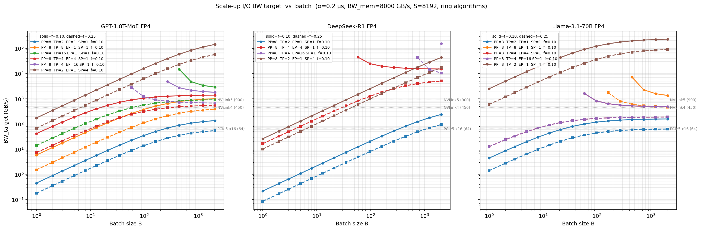
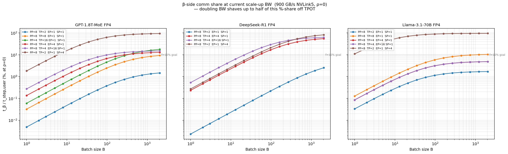
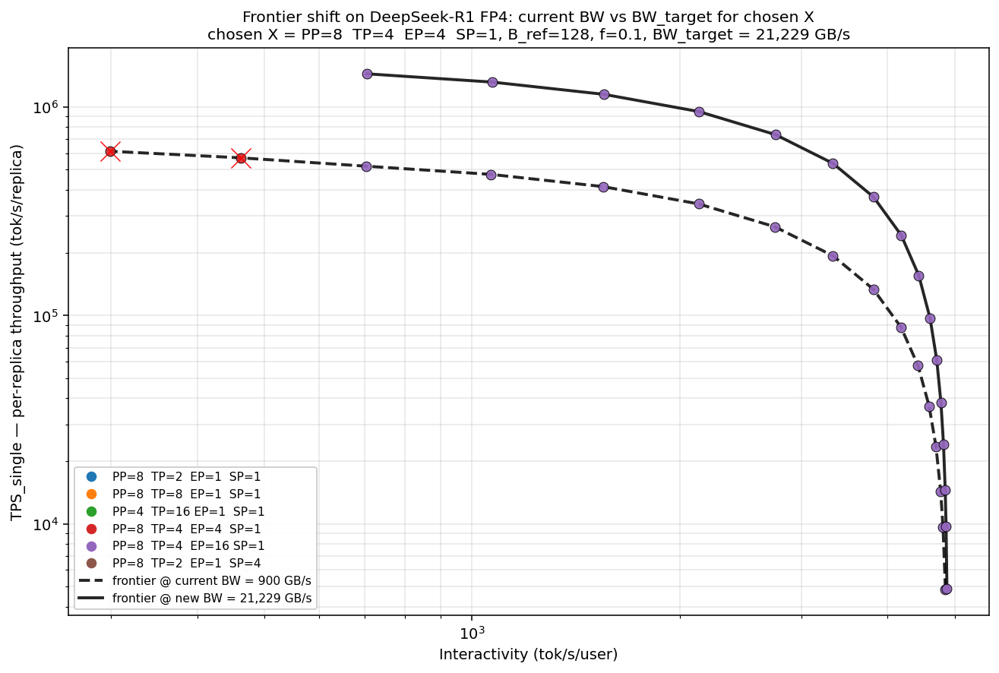

# When Does More Scale-up I/O Bandwidth Help?

**Author:** Yue Lu  
**Date:** April 2026  

A closed-form derivation of the bandwidth and α thresholds above which extra scale-up input/output (I/O) stops moving the per-step decode time.

This explainer answers a recurring practical question: given a fixed model and partition, at what point does buying more NVLink (or InfiniBand / PCIe) bandwidth stop helping decode time-per-output-token (TPOT)? The same derivation gives the dual α threshold for latency-side improvements.

The setup assumes the workload is **memory-bound** at the chosen batch size — *t*local = *t*mem — which is the typical decode regime for long-context inference. It also uses the per-stage hardware step time and overlap factor *ρ* from `decode.md §6.2`.

---

## 1. The per-stage hardware time

From `decode.md §6.2`, the per-stage hardware step time composes the GPU-only roofline with the unhidden remainder of communication:

$$
t_\mathrm{stage,hw}(B) \;=\; t_\mathrm{local}(B) \;+\; \max\!\bigl(0,\; t_\mathrm{comm}(B) - \rho \cdot t_\mathrm{local}(B)\bigr)
$$

where *ρ* ∈ [0, 1] is the fraction of *t*local available to overlap with *t*comm. Two regimes:

- *t*comm ≤ *ρ* · *t*local → comm fully hidden, *t*stage,hw = *t*local.
- *t*comm > *ρ* · *t*local → unhidden remainder is paid: *t*stage,hw = (1 − *ρ*) · *t*local + *t*comm.

The first regime is the case where extra bandwidth or smaller α buys you nothing. The second is where bandwidth and α improvements help proportionally. Our goal is to find the bandwidth (or α) value that puts you exactly on the boundary.

---

## 2. Decomposing *t*comm into α-side and β-side

Per `decode.md §5.5`, the per-stage aggregated communication sums one term per parallelism axis. Each per-call cost follows the Hockney α–β model: *t*X = *n*α · α + *n*β · *M* / *BW*. Collecting all the α-side counts and β-side payloads yields:

$$
t_\mathrm{comm}(B) \;=\; \underbrace{a_p \cdot \alpha}_{\text{α-side, count-driven}} \;+\; \underbrace{\frac{b_p(B)}{BW}}_{\text{β-side, payload-driven}}
$$

The two **partition coefficients** are fixed once you pick `(L, PP, TP, EP, SP)` and the shipped algorithms (ring all-reduce, ring all-gather, pairwise all-to-all, point-to-point hop):

$$
a_p \;=\; \frac{L}{PP}\,n_\mathrm{TP}\,2(G_\mathrm{TP}{-}1)
\;+\; \frac{L_\mathrm{moe}}{PP}\,n_\mathrm{EP}\,2(G_\mathrm{EP}{-}1)
\;+\; \frac{L}{PP}\,n_\mathrm{SP}\,(G_\mathrm{SP}{-}1)
\;+\; 1
$$

$$
b_p(B) \;=\; \frac{L}{PP}\,n_\mathrm{TP}\frac{2(G_\mathrm{TP}{-}1)}{G_\mathrm{TP}}\,B H b
\;+\; \frac{L_\mathrm{moe}}{PP}\,n_\mathrm{EP}\frac{2(G_\mathrm{EP}{-}1)}{G_\mathrm{EP}}\,B k H b
\;+\; \frac{L}{PP}\,n_\mathrm{SP}\frac{G_\mathrm{SP}{-}1}{G_\mathrm{SP}}\,B S\,\frac{2H_\mathrm{kv}}{TP}\,b
\;+\; B\,\frac{H}{TP}\,b
$$

The four terms in each equation are: tensor-parallel (TP) all-reduce, expert-parallel (EP) all-to-all (Dispatch + Combine), sequence-parallel (SP) all-gather, and pipeline-parallel (PP) point-to-point hop. *G*X is the group size for each axis. For other algorithm choices (double binary tree all-reduce, in-network collective via NVLink SHARP / NVLS, hierarchical reduce-scatter → sub-AR → all-gather), substitute the corresponding (*n*α, *n*β) coefficients from `documentation/modeling/collectives/00_summary.md §4`.

Important properties:

- *a*p depends only on the partition shape — independent of *B*, *BW*, α, or the model's *H* / *I*moe.
- *b*p(*B*) is linear in *B* — every collective payload scales with the batch.
- Both coefficients vanish on parallelism axes that are 1 (no collective fires).

---

## 3. The memory-bound assumption

Long-context decode is essentially always memory-bandwidth-pinned, with *t*local set by high-bandwidth memory (HBM):

$$
t_\mathrm{local}(B) \;=\; t_\mathrm{mem}(B) \;=\; \frac{T_\theta + B \cdot T_\mathrm{KV}}{BW_\mathrm{mem}}
$$

where *T*θ is the per-device weight bytes (`decode.md §2.1`) and *T*KV is the per-request key-value (KV) cache bytes (`decode.md §2.3`). Expanding each term lets us see how the partition shape moves *t*mem.

### Per-device weight bytes

For a model with *L*dense dense layers and *L*moe MoE layers (*L*dense + *L*moe = *L*), the per-device weight read on one PP stage is:

$$
T_\theta \;=\; \frac{L_\mathrm{dense}}{PP}\!\left(\frac{2H^2 + 2H\,H_\mathrm{kv}}{TP} + \frac{3H\,I_\mathrm{dense}}{TP}\right) b
\;+\; \frac{L_\mathrm{moe}}{PP}\!\left(\frac{2H^2 + 2H\,H_\mathrm{kv}}{TP} + \frac{3H\,I_\mathrm{moe}\,N_\mathrm{exp}}{TP \cdot EP}\right) b
$$

The four pieces are: dense attention QKVO (2*H*² + 2*HH*kv), dense FFN gate+up+down (3*HI*dense), MoE attention (same shape as dense), and MoE FFN (3*HI*moe per expert × *N*exp total experts). Each term is sharded as follows:

- **PP** divides the total layer count into per-stage shares — every term gets a 1/*PP* factor.
- **TP** shards every per-layer matrix along the head or hidden dimension — every term gets a 1/*TP* factor.
- **EP** shards only the MoE FFN slice across expert groups — only the (3*HI*moe·*N*exp) term gets the 1/*EP* factor.

For a pure-MoE model (*L*dense = 0, *L*moe = *L*) this collapses to:

$$
T_\theta \;=\; \frac{L}{PP}\!\left(\frac{2H^2 + 2H\,H_\mathrm{kv}}{TP} + \frac{3H\,I_\mathrm{moe}\,N_\mathrm{exp}}{TP \cdot EP}\right) b
$$

### Per-request KV cache bytes

Each sequence stores its own *S*-token K and V history per layer per PP stage; SP shards the sequence dimension across SP ranks:

$$
T_\mathrm{KV} \;=\; \frac{L}{PP} \cdot \frac{2 S H_\mathrm{kv}}{TP \cdot SP} \cdot b
$$

The 2 covers K and V; *H*kv = (*H* / *n*q) · *n*kv is the per-token key/value width (smaller than *H* for grouped-query attention).

### Substituted memory time

Combining the two:

$$
t_\mathrm{mem}(B) \;=\; \frac{L}{PP \cdot BW_\mathrm{mem}} \cdot b \cdot \left[\frac{2H^2 + 2H\,H_\mathrm{kv}}{TP} + \frac{3H\,I_\mathrm{moe}\,N_\mathrm{exp}}{TP \cdot EP} + B \cdot \frac{2 S H_\mathrm{kv}}{TP \cdot SP}\right]
$$

Three knobs to read:

- **Doubling PP** halves *t*mem for free (no comm cost in this expression — comm appears separately as *t*comm).
- **Doubling TP** halves *t*mem too, but inflates *a*p, *b*p in the comm formula because TP groups grow.
- **Doubling EP** halves only the MoE FFN slice; the attention and KV terms are untouched. This is why EP only beats PP on workloads where the MoE FFN slice dominates total weight (see `pareto_basic.ipynb` discussion).

The break-even derivation in §4 uses the abstract *T*θ, *T*KV, *t*mem symbols; substitute the expressions above to get a fully-specified *BW**\** in model + partition coordinates.

Plugging into the unhidden-comm condition:

$$
t_\mathrm{comm}(B) \;>\; \rho \cdot t_\mathrm{mem}(B)
\;\;\;\Longleftrightarrow\;\;\;
a_p\,\alpha \;+\; \frac{b_p(B)}{BW} \;>\; \rho \cdot \frac{T_\theta + B\,T_\mathrm{KV}}{BW_\mathrm{mem}}
$$

This is the condition for "bandwidth or α changes affect *t*stage,hw". When it holds, communication is paid in part; when it fails, communication is fully hidden and bandwidth and α are inert.

---

## 4. Solving for the bandwidth break-even

Treating *BW* as the free variable and solving the boundary case (*t*comm = *ρ* · *t*mem):

$$
a_p\,\alpha \;+\; \frac{b_p(B)}{BW} \;=\; \rho \cdot \frac{T_\theta + B\,T_\mathrm{KV}}{BW_\mathrm{mem}}
$$

Move the α term across:

$$
\frac{b_p(B)}{BW} \;=\; \rho \cdot \frac{T_\theta + B\,T_\mathrm{KV}}{BW_\mathrm{mem}} \;-\; a_p\,\alpha
$$

Invert:

$$
BW^* (B) \;=\;
\frac{b_p(B)}
     {\;\;\rho \cdot \dfrac{T_\theta + B\,T_\mathrm{KV}}{BW_\mathrm{mem}} \;-\; a_p\,\alpha\;\;}
\qquad \text{(valid when }\rho\,t_\mathrm{mem} > a_p\,\alpha\text{)}
$$

Reading the threshold:

- *BW* ≥ *BW**\** → comm fits inside the *ρ* · *t*mem overlap budget → **extra bandwidth does nothing**.
- *BW* < *BW**\** → comm overflows the budget; the unhidden remainder shrinks with *BW* → **extra bandwidth helps proportionally**.

The denominator becoming non-positive — *ρ* · *t*mem ≤ *a*p · α — means α alone exhausts the overlap budget. In that regime the boundary is unreachable: communication is **always** unhidden no matter how big *BW* gets, and any *BW* improvement helps. This is what happens at very small *t*mem (small *B*, no weight-read amortization) or very high α (legacy fabrics, software collectives over slow links).

---

## 5. Solving for the α break-even

By symmetry, fix *BW* and treat α as the free variable. Setting *t*comm = *ρ* · *t*mem and solving for α:

$$
\alpha^* (B) \;=\;
\frac{1}{a_p}\!\left[\rho \cdot \frac{T_\theta + B\,T_\mathrm{KV}}{BW_\mathrm{mem}} \;-\; \frac{b_p(B)}{BW}\right]
$$

α ≤ α*\** → α-side comm fits in the overlap budget → **smaller α does nothing**.

α > α*\** → comm overflows the budget; tightening α helps.

The two thresholds (*BW**\**, α*\**) trace out the same boundary in the (*BW*, α) plane — the curve separating the *fully-hidden* regime from the *unhidden* regime.

---

## 6. Design-goal target: *t*comm as a bounded fraction of *t*mem

The §4 break-even ties BW to the overlap factor ρ — the question "what BW puts comm exactly at the edge of the overlap budget?". A more useful design framing flips the question: pick a target fraction *f* (e.g., *f* = 0.1 = 10%) and ask "what BW keeps total comm at most *f* · *t*mem, regardless of overlap?".

Setting *t*comm ≤ *f* · *t*mem and solving for *BW*:

$$
a_p\,\alpha + \frac{b_p(B)}{BW} \;\le\; f \cdot \frac{T_\theta + B\,T_\mathrm{KV}}{BW_\mathrm{mem}}
$$

$$
BW_\mathrm{target}(f, B) \;=\;
\frac{b_p(B)}
     {\;\;f \cdot \dfrac{T_\theta + B\,T_\mathrm{KV}}{BW_\mathrm{mem}} \;-\; a_p\,\alpha\;\;}
\qquad \text{(valid when } f\,t_\mathrm{mem} > a_p\,\alpha\text{)}
$$

Structurally identical to *BW**\** in §4 with *f* replacing ρ — but interpreted as a **design knob**, not a physical overlap rate.

### Reading *f*

*f* sets the maximum allowed comm cost as a fraction of the memory roofline:

- **f = 0.1**: aggressive, "comm should be at most 10% of *t*mem". Engineering choice that keeps the workload robustly memory-bound — even at ρ = 0 (no overlap), the visible TPOT inflation from comm is capped at 10%.
- **f = 0.25**: relaxed, "comm can be up to 25%". Acceptable if you're confident in ρ ≥ 0.5 production overlap (then visible comm is at most max(0, 0.25 − 0.5)·*t*mem = 0).
- **f = ρ**: recovers §4 — comm sits exactly at the edge of what overlap can hide.
- **f > ρ**: deliberately accepts some unhidden comm, bounded by (f − ρ)·*t*mem.

The design rule: pick *f* based on how memory-bound you want the workload to remain at worst case. *f* = 0.1 is a good default — it ensures comm overhead is below the typical run-to-run variation in HBM bandwidth itself, so comm becomes invisible to operational monitoring.

### Empirical sweep

Three models (GPT-1.8T MoE FP4 — attention-heavy 16 experts × *k* = 2; DeepSeek-R1 FP4 — MoE-FFN-heavy 256 experts × *k* = 9; Llama-3.1-70B FP4 — dense GQA reference) × six partition shapes (all capped at **PP ≤ 8** — the typical PP-capped operational regime where bubble cost / layer-count drives the latency budget; the unbounded-PP winner shapes from `pareto_basic.ipynb` would shift the *BW*target curves further down) × log-spaced *B* ∈ [1, 2048] × two design targets (*f* = 0.10 solid, *f* = 0.25 dashed). Defaults: α = 0.2 μs, *BW*mem = 8 TB/s, *S* = 8192, ring algorithms (no INC). Generated by `notebooks/scale_up_io_bw_target.ipynb`.

#### *BW*target vs batch size

Reading the plot: each curve is one (model, partition) pair; horizontal dotted lines mark common scale-up fabrics (NVLink5 = 900 GB/s, NVLink4 = 450 GB/s, PCIe5 x16 = 64 GB/s). A curve sitting **below** a fabric line means that fabric meets the design target on this configuration → extra BW is wasted. A curve **above** the line means BW investment helps; the §7 sensitivity formula gives the per-doubling savings. Curves missing entirely at small *B* are "unreachable" — *a*p · α exceeds *f* · *t*mem and no BW value hits the target.

#### β-side comm share at current BW

The marginal-sensitivity view from §7: at the current 900 GB/s NVLink5 reference (ρ = 0, no overlap), what fraction of *t*step,user is β-side communication? Doubling BW shaves up to **half** of the displayed percentage off TPOT. The 10% goal line marks the design target — anything below is comfortably memory-bound; anything above is a candidate for BW investment.

Patterns the two plots expose together:

- **PP=8 small-TP shapes** (PP=8 TP=2 / PP=8 TP=8 EP=1 SP=1): *BW*target stays well below NVLink5's 900 GB/s line for all three models; β-share is in the 0.1–5% range. **BW improvements move TPOT by less than 2.5%** even at the aggressive *f* = 0.10 target. (The unbounded-PP winners — e.g. PP=32 TP=2 — sit even lower; the PP=8 cap chosen here is the harder regime.)
- **PP=4 TP=16** (max-TP single-tier): *a*p ~1800 → *t*α ≈ 360 μs alone exceeds 10% of *t*mem at small *B* → *f* = 0.10 is unreachable; even *f* = 0.25 needs hundreds of GB/s. Wide-TP is BW-friendly only after INC drops *n*α.
- **EP=4 / EP=16 MoE shapes**: *t*mem shrinks (sharded FFN), so the *f* · *t*mem budget shrinks proportionally — high-EP small-*B* lives in the unreachable zone for *f* = 0.10 even at modest *a*p. The dashed *f* = 0.25 curves cover more of these cases.
- **SP=4 ring-attention**: per-layer KV-shard payload (`B · S · 2H_kv / TP`) drives *b*p into the GB-per-step range → *BW*target reaches **TB/s territory**. The only configuration in the sweep where current scale-up BW is genuinely under-provisioned, on every model.

To re-run with INC modeling, edit `a_p_coef` in the notebook to substitute *n*α = 2*k* (k = number of switching tiers crossed) for the TP and SP axes — see "If I have INC, can I assume tiny *a*p?" above for the per-axis substitution rules. Knobs (α, *BW*mem, *S*, *f* targets, models, partitions) are at the top of the notebook.

---

## 7. Per-partition vs frontier: when does *BW*target move the Pareto curve?

The §4 / §5 / §6 thresholds are all **per-partition**: given a chosen partition shape X, derive what bandwidth (or α) makes X's communication cost trivial relative to its memory roofline. The Pareto frontier (`pareto_vs_io.ipynb`) is **cross-partition**: an upper-right envelope over all valid `(partition, B)` candidates, with the optimizer free to pick any shape. Procuring *BW*target(X) improves X's TPOT — but whether the **frontier** improves depends on whether X is on (or joins) the frontier under the new bandwidth.

Three operational regimes:

1. **X is already a frontier winner AND bandwidth-bottlenecked.** Procuring more BW directly moves the frontier corner outward. Verify by checking the `pareto_vs_io` winners table at current BW: if X appears, and *t*β(X) is well above your *f* target (read it from the §5 plot in `notebooks/scale_up_io_bw_target.ipynb`), this is the best case.
2. **X is dominated at current BW, but procuring *BW*target lifts it onto the frontier.** Classic example: wide-TP shapes (PP=4 TP=16) are dominated at finite BW because the all-reduce cost outweighs the per-device weight savings, but become optimal at the ideal-I/O reference (39 of 40 frontier corners in `pareto_vs_io`'s ideal panel). Procuring BW on a wide-TP partition shifts the frontier to use wider-TP winners — the frontier improves, but **with a different partition shape** than the operator might have planned.
3. **X is dominated AND remains dominated even with more BW.** Common when X is bandwidth-bottlenecked but also worse on other axes (compute, memory). Procuring BW on X then doesn't help the frontier — the optimizer keeps picking some other partition for that corner. Wasted spend.

The closed-form *BW*target answers a per-partition question (TPOT delta from BW improvement); the frontier sweep answers the cross-partition question (which partition wins after BW improvement). Both are useful but distinct.

**Frontier upper bound.** The `pareto_vs_io` notebook plots an "ideal-I/O reference" (BW → ∞, α → 0, ρ = 1) — that's the maximum frontier headroom any BW investment can realize. The gap between realistic-BW frontiers and the ideal reference is the absolute ceiling on what BW + α improvements can buy. If your chosen X is already close to that reference at current BW, BW investment helps; if X is far below for compute or memory reasons, BW investment doesn't close the gap and you should look at HBM, FLOPS, or partition shape instead.

**Operational rule.** Compute *BW*target(X) per §6. If current BW < *BW*target, X gets a predictable TPOT improvement at the targeted BW. **To check whether the frontier itself moves**, re-run a partition-optimal sweep (`pareto_vs_io`-style) at the new BW: if X appears among the winners at any frontier corner, the frontier moves through X; if not, the frontier may still move (other partitions take over) but X-specific BW investment was only justified as part of the broader fabric upgrade. The companion notebook at `notebooks/scale_up_io_bw_target.ipynb` includes a "frontier-shift check" cell that automates this comparison for a single chosen X.

#### Worked frontier-shift example

Choosing X = DeepSeek-R1 FP4 / `PP=8 TP=4 EP=4 SP=1` / *B*ref = 128 / *f* = 0.10 → *BW*target(X) ≈ **21 TB/s** (~24× the 900 GB/s current NVLink5 reference). Re-sweeping the partition pool at both BWs:

- **Current-BW frontier**: X appears at **2** corners (mid-frontier).
- **New-BW (21 TB/s) frontier**: X appears at **0** corners.

This is a clean **regime 3 / regime 2 hybrid**: at current BW, X was a borderline frontier winner because comm wasn't yet the dominant cost. Once BW grows 24×, comm becomes nearly free for *every* partition — and the optimizer reallocates the win to wider-TP / shallower-PP shapes that previously paid an unacceptable comm penalty. X's TPOT did improve (the *BW*target formula's per-partition prediction is correct), but X stopped being the *best* shape at the new BW.

The takeaway: per-partition BW improvements are real, but the cross-partition optimizer can re-route the win to a different shape under the new fabric. **Always check the frontier sweep before justifying BW investment by appeal to a single chosen partition's *BW*target**.

---

## 8. Marginal sensitivity in the unhidden regime

When the partition is in the unhidden regime, *t*stage,hw = (1 − *ρ*) · *t*mem + *t*comm. Taking partial derivatives:

$$
\frac{\partial \,t_\mathrm{stage,hw}}{\partial (1/BW)} \;=\; b_p(B), \qquad
\frac{\partial \,t_\mathrm{stage,hw}}{\partial \alpha} \;=\; a_p
$$

So **doubling *BW* shaves *b*p(*B*) / (2 · *BW*) = *t*β / 2 off *t*stage,hw**. As a fractional improvement of the user-observed step time *t*step,user:

$$
\frac{\Delta t_\mathrm{step,user}}{t_\mathrm{step,user}} \;\approx\; \frac{1}{2}\cdot\frac{t_\beta(B)}{t_\mathrm{step,user}}
\qquad \text{(BW doubling, in the unhidden regime)}
$$

The same form gives the α improvement: halving α saves *a*p · α / 2 = *t*α / 2.

---

## 9. The role of *ρ*

The break-even threshold scales with *ρ* in the denominator. Two limits:

**ρ = 0 (no overlap)**: *BW**\** = − *b*p(*B*) / (*a*p · α), which is negative → **comm is always unhidden** and bandwidth changes always matter (proportional to *t*β / *t*step).

**ρ = 1 (perfect overlap)**: *BW**\** = *b*p(*B*) / (*t*mem − *a*p·α), the largest possible threshold — communication gets the full *t*mem budget to hide under, so *BW* has to drop very low before it becomes the bottleneck.

The **ρ knob has more leverage than the BW knob** for typical decode workloads. Going from ρ = 0 to ρ = 0.5 can collapse a 30-μs unhidden comm to 0 at no hardware cost, while doubling bandwidth only halves the β-side payload. This is why production stacks invest heavily in CUDA-stream pipelining (raising effective *ρ*) before reaching for more bandwidth.

---

## 10. The decision rule, distilled

Given a (model, system, partition, *B*, *ρ*) operating point and a design target *f* (e.g., 0.1):

1. Compute *a*p, *b*p(*B*) from §2 — depends only on partition shape and ladder.
2. Compute *t*mem(*B*) = (*T*θ + *B* · *T*KV) / *BW*mem.
3. Compute *t*α = *a*p · α and *t*β(*B*) = *b*p(*B*) / *BW*.
4. Compute *BW*target(*f*, *B*) = *b*p(*B*) / (*f* · *t*mem − *a*p · α) (§6) and check current *BW* against it:
   - **Current *BW* ≥ *BW*target** → comm is below the *f* · *t*mem design cap; extra bandwidth is wasted. Use the slot elsewhere (HBM, FLOPS, more GPUs for data parallel replicas) or tighten α / *ρ*.
   - **Current *BW* < *BW*target** → comm exceeds the design target; bandwidth improvement saves up to *t*β/2 per doubling (§7). Worth the spend until you reach *BW*target.
   - **Denominator non-positive** → α alone exceeds *f* · *t*mem; bandwidth can't reach the target regardless. Tighten α or pick a larger *f*.

The same logic with the α★ formula in §5 covers the dual question of when latency-side improvements matter.

---

## See also

- `decode.md §6.2` — the *t*stage,hw composition and *ρ* definition.
- `decode.md §5.5` — the per-stage *t*comm formula that *a*p, *b*p(*B*) collect from.
- `documentation/modeling/collectives/00_summary.md §4` — the per-algorithm (*n*α, *n*β) values to substitute into *a*p and *b*p for non-ring algorithms.
- `pareto_vs_io.ipynb` — empirical Pareto sweeps that show frontier saturation under exactly this break-even logic (when the optimizer routes around comm-heavy partitions, you sit far above *BW**\** and bandwidth improvements are invisible).
- `pareto_vs_scale_up_tier.ipynb` — the partition-FORCED lens, where *BW**\** is below current *BW* and the frontier *does* move with *BW*.
